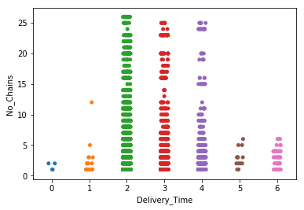
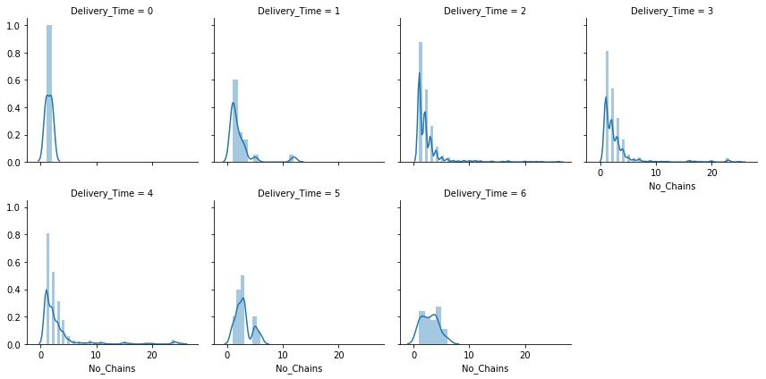
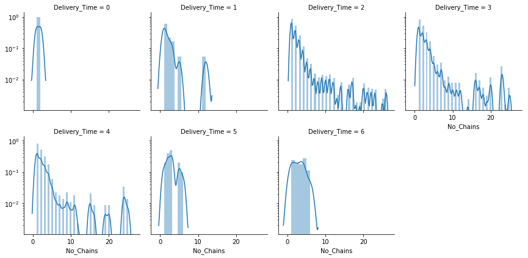

```python
import pandas as pd
import numpy as np
import matplotlib.pyplot as plt

pd.pandas.set_option('display.max_columns', None)
%config IPCompleter.greedy=True
```


```python
# load dataset
data = pd.read_excel('./Data_Train.xlsx')
print(data.shape)
data.head()

# load dataset
data_test = pd.read_excel('./Data_Test.xlsx')
print(data_test.shape)
data_test.head()

data.Delivery_Time = data.Delivery_Time.replace(to_replace ='[^0-9]+', value = '', regex = True)
dict1 = {'10':0,'20':1,'30':2,'45':3,'65':4,'80':5,'120':6}
data['Delivery_Time'] = data['Delivery_Time'].map(dict1)

data_all = pd.concat([data,data_test],sort=False)
data_all.shape
```

    (11094, 9)
    (2774, 8)


    (13868, 9)


# Location & Cuisines


```python
data['City']=data['Location'].str.split(',').map(lambda x: x[-1])
data_test['City']=data_test['Location'].str.split(',').map(lambda x: x[-1])
```


```python
%%capture
from tqdm import tqdm_notebook as tqdm
tqdm().pandas()

import re
import nltk
nltk.download('stopwords')
from nltk.corpus import stopwords
from nltk.stem.porter import PorterStemmer
```


```python
from sklearn.feature_extraction.text import CountVectorizer
```


```python
corpus = []
for i in tqdm(range(0, 11094)):
    review = re.sub('[^a-zA-Z]', ' ', data['Cuisines'][i])
    review = review.lower()
    review = review.split()
    ps = PorterStemmer()
    review = [ps.stem(word) for word in review if not word in set(stopwords.words('english'))]
    review = ' '.join(review)
    corpus.append(review)
    
```


    HBox(children=(IntProgress(value=0, max=11094), HTML(value='')))


    


```python
cv = CountVectorizer(max_features = 10)
X2 = cv.fit_transform(corpus).toarray()
X2 = pd.DataFrame(X2,columns=cv.get_feature_names())
data = pd.concat([data,X2],sort=False,axis=1)
data.head()
```


<div>
<style scoped>
    .dataframe tbody tr th:only-of-type {
        vertical-align: middle;
    }

    .dataframe tbody tr th {
        vertical-align: top;
    }

    .dataframe thead th {
        text-align: right;
    }
</style>
<table border="1" class="dataframe">
  <thead>
    <tr style="text-align: right;">
      <th></th>
      <th>Restaurant</th>
      <th>Location</th>
      <th>Cuisines</th>
      <th>Average_Cost</th>
      <th>Minimum_Order</th>
      <th>Rating</th>
      <th>Votes</th>
      <th>Reviews</th>
      <th>Delivery_Time</th>
      <th>City</th>
      <th>beverag</th>
      <th>biryani</th>
      <th>chines</th>
      <th>dessert</th>
      <th>fast</th>
      <th>food</th>
      <th>indian</th>
      <th>mughlai</th>
      <th>north</th>
      <th>south</th>
    </tr>
  </thead>
  <tbody>
    <tr>
      <th>0</th>
      <td>ID_6321</td>
      <td>FTI College, Law College Road, Pune</td>
      <td>Fast Food, Rolls, Burger, Salad, Wraps</td>
      <td>₹200</td>
      <td>₹50</td>
      <td>3.5</td>
      <td>12</td>
      <td>4</td>
      <td>2</td>
      <td>Pune</td>
      <td>0</td>
      <td>0</td>
      <td>0</td>
      <td>0</td>
      <td>1</td>
      <td>1</td>
      <td>0</td>
      <td>0</td>
      <td>0</td>
      <td>0</td>
    </tr>
    <tr>
      <th>1</th>
      <td>ID_2882</td>
      <td>Sector 3, Marathalli</td>
      <td>Ice Cream, Desserts</td>
      <td>₹100</td>
      <td>₹50</td>
      <td>3.5</td>
      <td>11</td>
      <td>4</td>
      <td>2</td>
      <td>Marathalli</td>
      <td>0</td>
      <td>0</td>
      <td>0</td>
      <td>1</td>
      <td>0</td>
      <td>0</td>
      <td>0</td>
      <td>0</td>
      <td>0</td>
      <td>0</td>
    </tr>
    <tr>
      <th>2</th>
      <td>ID_1595</td>
      <td>Mumbai Central</td>
      <td>Italian, Street Food, Fast Food</td>
      <td>₹150</td>
      <td>₹50</td>
      <td>3.6</td>
      <td>99</td>
      <td>30</td>
      <td>4</td>
      <td>Mumbai Central</td>
      <td>0</td>
      <td>0</td>
      <td>0</td>
      <td>0</td>
      <td>1</td>
      <td>2</td>
      <td>0</td>
      <td>0</td>
      <td>0</td>
      <td>0</td>
    </tr>
    <tr>
      <th>3</th>
      <td>ID_5929</td>
      <td>Sector 1, Noida</td>
      <td>Mughlai, North Indian, Chinese</td>
      <td>₹250</td>
      <td>₹99</td>
      <td>3.7</td>
      <td>176</td>
      <td>95</td>
      <td>2</td>
      <td>Noida</td>
      <td>0</td>
      <td>0</td>
      <td>1</td>
      <td>0</td>
      <td>0</td>
      <td>0</td>
      <td>1</td>
      <td>1</td>
      <td>1</td>
      <td>0</td>
    </tr>
    <tr>
      <th>4</th>
      <td>ID_6123</td>
      <td>Rmz Centennial, I Gate, Whitefield</td>
      <td>Cafe, Beverages</td>
      <td>₹200</td>
      <td>₹99</td>
      <td>3.2</td>
      <td>521</td>
      <td>235</td>
      <td>4</td>
      <td>Whitefield</td>
      <td>1</td>
      <td>0</td>
      <td>0</td>
      <td>0</td>
      <td>0</td>
      <td>0</td>
      <td>0</td>
      <td>0</td>
      <td>0</td>
      <td>0</td>
    </tr>
  </tbody>
</table>
</div>


```python
corpus = []
for i in tqdm(range(0, 2774)):
    review = re.sub('[^a-zA-Z]', ' ', data_test['Cuisines'][i])
    review = review.lower()
    review = review.split()
    ps = PorterStemmer()
    review = [ps.stem(word) for word in review if not word in set(stopwords.words('english'))]
    review = ' '.join(review)
    corpus.append(review)
    
X3 = cv.transform(corpus).toarray()
X3 = pd.DataFrame(X3,columns=cv.get_feature_names())
data_test = pd.concat([data_test,X3],sort=False,axis=1)
data_test.head()
```


    HBox(children=(IntProgress(value=0, max=2774), HTML(value='')))


    


<div>
<style scoped>
    .dataframe tbody tr th:only-of-type {
        vertical-align: middle;
    }

    .dataframe tbody tr th {
        vertical-align: top;
    }

    .dataframe thead th {
        text-align: right;
    }
</style>
<table border="1" class="dataframe">
  <thead>
    <tr style="text-align: right;">
      <th></th>
      <th>Restaurant</th>
      <th>Location</th>
      <th>Cuisines</th>
      <th>Average_Cost</th>
      <th>Minimum_Order</th>
      <th>Rating</th>
      <th>Votes</th>
      <th>Reviews</th>
      <th>City</th>
      <th>beverag</th>
      <th>biryani</th>
      <th>chines</th>
      <th>dessert</th>
      <th>fast</th>
      <th>food</th>
      <th>indian</th>
      <th>mughlai</th>
      <th>north</th>
      <th>south</th>
    </tr>
  </thead>
  <tbody>
    <tr>
      <th>0</th>
      <td>ID_2842</td>
      <td>Mico Layout, Stage 2, BTM Layout,Bangalore</td>
      <td>North Indian, Chinese, Assamese</td>
      <td>₹350</td>
      <td>₹50</td>
      <td>4.2</td>
      <td>361</td>
      <td>225</td>
      <td>Bangalore</td>
      <td>0</td>
      <td>0</td>
      <td>1</td>
      <td>0</td>
      <td>0</td>
      <td>0</td>
      <td>1</td>
      <td>0</td>
      <td>1</td>
      <td>0</td>
    </tr>
    <tr>
      <th>1</th>
      <td>ID_730</td>
      <td>Mico Layout, Stage 2, BTM Layout,Bangalore</td>
      <td>Biryani, Kebab</td>
      <td>₹100</td>
      <td>₹50</td>
      <td>NEW</td>
      <td>-</td>
      <td>-</td>
      <td>Bangalore</td>
      <td>0</td>
      <td>1</td>
      <td>0</td>
      <td>0</td>
      <td>0</td>
      <td>0</td>
      <td>0</td>
      <td>0</td>
      <td>0</td>
      <td>0</td>
    </tr>
    <tr>
      <th>2</th>
      <td>ID_4620</td>
      <td>Sector 1, Noida</td>
      <td>Fast Food</td>
      <td>₹100</td>
      <td>₹50</td>
      <td>3.6</td>
      <td>36</td>
      <td>16</td>
      <td>Noida</td>
      <td>0</td>
      <td>0</td>
      <td>0</td>
      <td>0</td>
      <td>1</td>
      <td>1</td>
      <td>0</td>
      <td>0</td>
      <td>0</td>
      <td>0</td>
    </tr>
    <tr>
      <th>3</th>
      <td>ID_5470</td>
      <td>Babarpur, New Delhi, Delhi</td>
      <td>Mithai, North Indian, Chinese, Fast Food, Sout...</td>
      <td>₹200</td>
      <td>₹50</td>
      <td>3.6</td>
      <td>66</td>
      <td>33</td>
      <td>Delhi</td>
      <td>0</td>
      <td>0</td>
      <td>1</td>
      <td>0</td>
      <td>1</td>
      <td>1</td>
      <td>2</td>
      <td>0</td>
      <td>1</td>
      <td>1</td>
    </tr>
    <tr>
      <th>4</th>
      <td>ID_3249</td>
      <td>Sector 1, Noida</td>
      <td>Chinese, Fast Food</td>
      <td>₹150</td>
      <td>₹50</td>
      <td>2.9</td>
      <td>38</td>
      <td>14</td>
      <td>Noida</td>
      <td>0</td>
      <td>0</td>
      <td>1</td>
      <td>0</td>
      <td>1</td>
      <td>1</td>
      <td>0</td>
      <td>0</td>
      <td>0</td>
      <td>0</td>
    </tr>
  </tbody>
</table>
</div>


# Restaurant_ID


```python
temp = data_all['Restaurant'].value_counts().reset_index()
```


```python
temp.columns=['Restaurant','No_Chains']
temp.head()
```


<div>
<style scoped>
    .dataframe tbody tr th:only-of-type {
        vertical-align: middle;
    }

    .dataframe tbody tr th {
        vertical-align: top;
    }

    .dataframe thead th {
        text-align: right;
    }
</style>
<table border="1" class="dataframe">
  <thead>
    <tr style="text-align: right;">
      <th></th>
      <th>Restaurant</th>
      <th>No_Chains</th>
    </tr>
  </thead>
  <tbody>
    <tr>
      <th>0</th>
      <td>ID_5538</td>
      <td>26</td>
    </tr>
    <tr>
      <th>1</th>
      <td>ID_7184</td>
      <td>25</td>
    </tr>
    <tr>
      <th>2</th>
      <td>ID_2483</td>
      <td>24</td>
    </tr>
    <tr>
      <th>3</th>
      <td>ID_4654</td>
      <td>23</td>
    </tr>
    <tr>
      <th>4</th>
      <td>ID_7295</td>
      <td>23</td>
    </tr>
  </tbody>
</table>
</div>


```python
data = pd.merge(data,temp,on=['Restaurant'],how='left')
data_test = pd.merge(data_test,temp,on=['Restaurant'],how='left')
```


```python
data['Is_Chain'] = np.where(data['No_Chains']>1,1,0)
data_test['Is_Chain'] = np.where(data_test['No_Chains']>1,1,0)
```


```python
data.head()
```


<div>
<style scoped>
    .dataframe tbody tr th:only-of-type {
        vertical-align: middle;
    }

    .dataframe tbody tr th {
        vertical-align: top;
    }

    .dataframe thead th {
        text-align: right;
    }
</style>
<table border="1" class="dataframe">
  <thead>
    <tr style="text-align: right;">
      <th></th>
      <th>Restaurant</th>
      <th>Location</th>
      <th>Cuisines</th>
      <th>Average_Cost</th>
      <th>Minimum_Order</th>
      <th>Rating</th>
      <th>Votes</th>
      <th>Reviews</th>
      <th>Delivery_Time</th>
      <th>City</th>
      <th>beverag</th>
      <th>biryani</th>
      <th>chines</th>
      <th>dessert</th>
      <th>fast</th>
      <th>food</th>
      <th>indian</th>
      <th>mughlai</th>
      <th>north</th>
      <th>south</th>
      <th>No_Chains</th>
      <th>Is_Chain</th>
    </tr>
  </thead>
  <tbody>
    <tr>
      <th>0</th>
      <td>ID_6321</td>
      <td>FTI College, Law College Road, Pune</td>
      <td>Fast Food, Rolls, Burger, Salad, Wraps</td>
      <td>₹200</td>
      <td>₹50</td>
      <td>3.5</td>
      <td>12</td>
      <td>4</td>
      <td>2</td>
      <td>Pune</td>
      <td>0</td>
      <td>0</td>
      <td>0</td>
      <td>0</td>
      <td>1</td>
      <td>1</td>
      <td>0</td>
      <td>0</td>
      <td>0</td>
      <td>0</td>
      <td>1</td>
      <td>0</td>
    </tr>
    <tr>
      <th>1</th>
      <td>ID_2882</td>
      <td>Sector 3, Marathalli</td>
      <td>Ice Cream, Desserts</td>
      <td>₹100</td>
      <td>₹50</td>
      <td>3.5</td>
      <td>11</td>
      <td>4</td>
      <td>2</td>
      <td>Marathalli</td>
      <td>0</td>
      <td>0</td>
      <td>0</td>
      <td>1</td>
      <td>0</td>
      <td>0</td>
      <td>0</td>
      <td>0</td>
      <td>0</td>
      <td>0</td>
      <td>6</td>
      <td>1</td>
    </tr>
    <tr>
      <th>2</th>
      <td>ID_1595</td>
      <td>Mumbai Central</td>
      <td>Italian, Street Food, Fast Food</td>
      <td>₹150</td>
      <td>₹50</td>
      <td>3.6</td>
      <td>99</td>
      <td>30</td>
      <td>4</td>
      <td>Mumbai Central</td>
      <td>0</td>
      <td>0</td>
      <td>0</td>
      <td>0</td>
      <td>1</td>
      <td>2</td>
      <td>0</td>
      <td>0</td>
      <td>0</td>
      <td>0</td>
      <td>3</td>
      <td>1</td>
    </tr>
    <tr>
      <th>3</th>
      <td>ID_5929</td>
      <td>Sector 1, Noida</td>
      <td>Mughlai, North Indian, Chinese</td>
      <td>₹250</td>
      <td>₹99</td>
      <td>3.7</td>
      <td>176</td>
      <td>95</td>
      <td>2</td>
      <td>Noida</td>
      <td>0</td>
      <td>0</td>
      <td>1</td>
      <td>0</td>
      <td>0</td>
      <td>0</td>
      <td>1</td>
      <td>1</td>
      <td>1</td>
      <td>0</td>
      <td>2</td>
      <td>1</td>
    </tr>
    <tr>
      <th>4</th>
      <td>ID_6123</td>
      <td>Rmz Centennial, I Gate, Whitefield</td>
      <td>Cafe, Beverages</td>
      <td>₹200</td>
      <td>₹99</td>
      <td>3.2</td>
      <td>521</td>
      <td>235</td>
      <td>4</td>
      <td>Whitefield</td>
      <td>1</td>
      <td>0</td>
      <td>0</td>
      <td>0</td>
      <td>0</td>
      <td>0</td>
      <td>0</td>
      <td>0</td>
      <td>0</td>
      <td>0</td>
      <td>1</td>
      <td>0</td>
    </tr>
  </tbody>
</table>
</div>


```python
data_test.head()
```


<div>
<style scoped>
    .dataframe tbody tr th:only-of-type {
        vertical-align: middle;
    }

    .dataframe tbody tr th {
        vertical-align: top;
    }

    .dataframe thead th {
        text-align: right;
    }
</style>
<table border="1" class="dataframe">
  <thead>
    <tr style="text-align: right;">
      <th></th>
      <th>Restaurant</th>
      <th>Location</th>
      <th>Cuisines</th>
      <th>Average_Cost</th>
      <th>Minimum_Order</th>
      <th>Rating</th>
      <th>Votes</th>
      <th>Reviews</th>
      <th>City</th>
      <th>beverag</th>
      <th>biryani</th>
      <th>chines</th>
      <th>dessert</th>
      <th>fast</th>
      <th>food</th>
      <th>indian</th>
      <th>mughlai</th>
      <th>north</th>
      <th>south</th>
      <th>No_Chains</th>
      <th>Is_Chain</th>
    </tr>
  </thead>
  <tbody>
    <tr>
      <th>0</th>
      <td>ID_2842</td>
      <td>Mico Layout, Stage 2, BTM Layout,Bangalore</td>
      <td>North Indian, Chinese, Assamese</td>
      <td>₹350</td>
      <td>₹50</td>
      <td>4.2</td>
      <td>361</td>
      <td>225</td>
      <td>Bangalore</td>
      <td>0</td>
      <td>0</td>
      <td>1</td>
      <td>0</td>
      <td>0</td>
      <td>0</td>
      <td>1</td>
      <td>0</td>
      <td>1</td>
      <td>0</td>
      <td>1</td>
      <td>0</td>
    </tr>
    <tr>
      <th>1</th>
      <td>ID_730</td>
      <td>Mico Layout, Stage 2, BTM Layout,Bangalore</td>
      <td>Biryani, Kebab</td>
      <td>₹100</td>
      <td>₹50</td>
      <td>NEW</td>
      <td>-</td>
      <td>-</td>
      <td>Bangalore</td>
      <td>0</td>
      <td>1</td>
      <td>0</td>
      <td>0</td>
      <td>0</td>
      <td>0</td>
      <td>0</td>
      <td>0</td>
      <td>0</td>
      <td>0</td>
      <td>1</td>
      <td>0</td>
    </tr>
    <tr>
      <th>2</th>
      <td>ID_4620</td>
      <td>Sector 1, Noida</td>
      <td>Fast Food</td>
      <td>₹100</td>
      <td>₹50</td>
      <td>3.6</td>
      <td>36</td>
      <td>16</td>
      <td>Noida</td>
      <td>0</td>
      <td>0</td>
      <td>0</td>
      <td>0</td>
      <td>1</td>
      <td>1</td>
      <td>0</td>
      <td>0</td>
      <td>0</td>
      <td>0</td>
      <td>2</td>
      <td>1</td>
    </tr>
    <tr>
      <th>3</th>
      <td>ID_5470</td>
      <td>Babarpur, New Delhi, Delhi</td>
      <td>Mithai, North Indian, Chinese, Fast Food, Sout...</td>
      <td>₹200</td>
      <td>₹50</td>
      <td>3.6</td>
      <td>66</td>
      <td>33</td>
      <td>Delhi</td>
      <td>0</td>
      <td>0</td>
      <td>1</td>
      <td>0</td>
      <td>1</td>
      <td>1</td>
      <td>2</td>
      <td>0</td>
      <td>1</td>
      <td>1</td>
      <td>1</td>
      <td>0</td>
    </tr>
    <tr>
      <th>4</th>
      <td>ID_3249</td>
      <td>Sector 1, Noida</td>
      <td>Chinese, Fast Food</td>
      <td>₹150</td>
      <td>₹50</td>
      <td>2.9</td>
      <td>38</td>
      <td>14</td>
      <td>Noida</td>
      <td>0</td>
      <td>0</td>
      <td>1</td>
      <td>0</td>
      <td>1</td>
      <td>1</td>
      <td>0</td>
      <td>0</td>
      <td>0</td>
      <td>0</td>
      <td>2</td>
      <td>1</td>
    </tr>
  </tbody>
</table>
</div>


```python
data['No_Chains'].unique()
```


    array([ 1,  6,  3,  2,  5,  8,  9,  4, 23, 16, 11, 22, 14,  7, 10, 17, 20,
           21, 12, 18, 25, 24, 26, 13, 15, 19])


```python
import seaborn as sns
```


```python
sns.stripplot(y='No_Chains',x='Delivery_Time',data=data)
```


    <matplotlib.axes._subplots.AxesSubplot at 0x1a22133a58>





```python
g = sns.FacetGrid(data, col="Delivery_Time",col_wrap=4)
g.map(sns.distplot, "No_Chains");

```

    /anaconda3/lib/python3.7/site-packages/scipy/stats/stats.py:1713: FutureWarning: Using a non-tuple sequence for multidimensional indexing is deprecated; use `arr[tuple(seq)]` instead of `arr[seq]`. In the future this will be interpreted as an array index, `arr[np.array(seq)]`, which will result either in an error or a different result.
      return np.add.reduce(sorted[indexer] * weights, axis=axis) / sumval





```python
g = sns.FacetGrid(data, col="Delivery_Time",col_wrap=4)
g.map(sns.distplot, "No_Chains");
g.set(yscale="log")
# Show plot
plt.show()
```

    /anaconda3/lib/python3.7/site-packages/scipy/stats/stats.py:1713: FutureWarning: Using a non-tuple sequence for multidimensional indexing is deprecated; use `arr[tuple(seq)]` instead of `arr[seq]`. In the future this will be interpreted as an array index, `arr[np.array(seq)]`, which will result either in an error or a different result.
      return np.add.reduce(sorted[indexer] * weights, axis=axis) / sumval





# Ratings and Others


```python
data.head()
```


<div>
<style scoped>
    .dataframe tbody tr th:only-of-type {
        vertical-align: middle;
    }

    .dataframe tbody tr th {
        vertical-align: top;
    }

    .dataframe thead th {
        text-align: right;
    }
</style>
<table border="1" class="dataframe">
  <thead>
    <tr style="text-align: right;">
      <th></th>
      <th>Restaurant</th>
      <th>Location</th>
      <th>Cuisines</th>
      <th>Average_Cost</th>
      <th>Minimum_Order</th>
      <th>Rating</th>
      <th>Votes</th>
      <th>Reviews</th>
      <th>Delivery_Time</th>
      <th>City</th>
      <th>beverag</th>
      <th>biryani</th>
      <th>chines</th>
      <th>dessert</th>
      <th>fast</th>
      <th>food</th>
      <th>indian</th>
      <th>mughlai</th>
      <th>north</th>
      <th>south</th>
      <th>No_Chains</th>
      <th>Is_Chain</th>
    </tr>
  </thead>
  <tbody>
    <tr>
      <th>0</th>
      <td>ID_6321</td>
      <td>FTI College, Law College Road, Pune</td>
      <td>Fast Food, Rolls, Burger, Salad, Wraps</td>
      <td>₹200</td>
      <td>₹50</td>
      <td>3.5</td>
      <td>12</td>
      <td>4</td>
      <td>2</td>
      <td>Pune</td>
      <td>0</td>
      <td>0</td>
      <td>0</td>
      <td>0</td>
      <td>1</td>
      <td>1</td>
      <td>0</td>
      <td>0</td>
      <td>0</td>
      <td>0</td>
      <td>1</td>
      <td>0</td>
    </tr>
    <tr>
      <th>1</th>
      <td>ID_2882</td>
      <td>Sector 3, Marathalli</td>
      <td>Ice Cream, Desserts</td>
      <td>₹100</td>
      <td>₹50</td>
      <td>3.5</td>
      <td>11</td>
      <td>4</td>
      <td>2</td>
      <td>Marathalli</td>
      <td>0</td>
      <td>0</td>
      <td>0</td>
      <td>1</td>
      <td>0</td>
      <td>0</td>
      <td>0</td>
      <td>0</td>
      <td>0</td>
      <td>0</td>
      <td>6</td>
      <td>1</td>
    </tr>
    <tr>
      <th>2</th>
      <td>ID_1595</td>
      <td>Mumbai Central</td>
      <td>Italian, Street Food, Fast Food</td>
      <td>₹150</td>
      <td>₹50</td>
      <td>3.6</td>
      <td>99</td>
      <td>30</td>
      <td>4</td>
      <td>Mumbai Central</td>
      <td>0</td>
      <td>0</td>
      <td>0</td>
      <td>0</td>
      <td>1</td>
      <td>2</td>
      <td>0</td>
      <td>0</td>
      <td>0</td>
      <td>0</td>
      <td>3</td>
      <td>1</td>
    </tr>
    <tr>
      <th>3</th>
      <td>ID_5929</td>
      <td>Sector 1, Noida</td>
      <td>Mughlai, North Indian, Chinese</td>
      <td>₹250</td>
      <td>₹99</td>
      <td>3.7</td>
      <td>176</td>
      <td>95</td>
      <td>2</td>
      <td>Noida</td>
      <td>0</td>
      <td>0</td>
      <td>1</td>
      <td>0</td>
      <td>0</td>
      <td>0</td>
      <td>1</td>
      <td>1</td>
      <td>1</td>
      <td>0</td>
      <td>2</td>
      <td>1</td>
    </tr>
    <tr>
      <th>4</th>
      <td>ID_6123</td>
      <td>Rmz Centennial, I Gate, Whitefield</td>
      <td>Cafe, Beverages</td>
      <td>₹200</td>
      <td>₹99</td>
      <td>3.2</td>
      <td>521</td>
      <td>235</td>
      <td>4</td>
      <td>Whitefield</td>
      <td>1</td>
      <td>0</td>
      <td>0</td>
      <td>0</td>
      <td>0</td>
      <td>0</td>
      <td>0</td>
      <td>0</td>
      <td>0</td>
      <td>0</td>
      <td>1</td>
      <td>0</td>
    </tr>
  </tbody>
</table>
</div>


```python
data.Average_Cost = data.Average_Cost.replace(to_replace ='[^0-9]+', value = '', regex = True)
data.Minimum_Order = data.Minimum_Order.replace(to_replace ='[^0-9]+', value = '', regex = True)
data.Delivery_Time = data.Delivery_Time.replace(to_replace ='[^0-9]+', value = '', regex = True)
data['Average_Cost'] = pd.to_numeric(data['Average_Cost'])
data['Minimum_Order'] = pd.to_numeric(data['Minimum_Order'])
data.head()
```


<div>
<style scoped>
    .dataframe tbody tr th:only-of-type {
        vertical-align: middle;
    }

    .dataframe tbody tr th {
        vertical-align: top;
    }

    .dataframe thead th {
        text-align: right;
    }
</style>
<table border="1" class="dataframe">
  <thead>
    <tr style="text-align: right;">
      <th></th>
      <th>Restaurant</th>
      <th>Location</th>
      <th>Cuisines</th>
      <th>Average_Cost</th>
      <th>Minimum_Order</th>
      <th>Rating</th>
      <th>Votes</th>
      <th>Reviews</th>
      <th>Delivery_Time</th>
      <th>City</th>
      <th>beverag</th>
      <th>biryani</th>
      <th>chines</th>
      <th>dessert</th>
      <th>fast</th>
      <th>food</th>
      <th>indian</th>
      <th>mughlai</th>
      <th>north</th>
      <th>south</th>
      <th>No_Chains</th>
      <th>Is_Chain</th>
    </tr>
  </thead>
  <tbody>
    <tr>
      <th>0</th>
      <td>ID_6321</td>
      <td>FTI College, Law College Road, Pune</td>
      <td>Fast Food, Rolls, Burger, Salad, Wraps</td>
      <td>200.0</td>
      <td>50</td>
      <td>3.5</td>
      <td>12</td>
      <td>4</td>
      <td>2</td>
      <td>Pune</td>
      <td>0</td>
      <td>0</td>
      <td>0</td>
      <td>0</td>
      <td>1</td>
      <td>1</td>
      <td>0</td>
      <td>0</td>
      <td>0</td>
      <td>0</td>
      <td>1</td>
      <td>0</td>
    </tr>
    <tr>
      <th>1</th>
      <td>ID_2882</td>
      <td>Sector 3, Marathalli</td>
      <td>Ice Cream, Desserts</td>
      <td>100.0</td>
      <td>50</td>
      <td>3.5</td>
      <td>11</td>
      <td>4</td>
      <td>2</td>
      <td>Marathalli</td>
      <td>0</td>
      <td>0</td>
      <td>0</td>
      <td>1</td>
      <td>0</td>
      <td>0</td>
      <td>0</td>
      <td>0</td>
      <td>0</td>
      <td>0</td>
      <td>6</td>
      <td>1</td>
    </tr>
    <tr>
      <th>2</th>
      <td>ID_1595</td>
      <td>Mumbai Central</td>
      <td>Italian, Street Food, Fast Food</td>
      <td>150.0</td>
      <td>50</td>
      <td>3.6</td>
      <td>99</td>
      <td>30</td>
      <td>4</td>
      <td>Mumbai Central</td>
      <td>0</td>
      <td>0</td>
      <td>0</td>
      <td>0</td>
      <td>1</td>
      <td>2</td>
      <td>0</td>
      <td>0</td>
      <td>0</td>
      <td>0</td>
      <td>3</td>
      <td>1</td>
    </tr>
    <tr>
      <th>3</th>
      <td>ID_5929</td>
      <td>Sector 1, Noida</td>
      <td>Mughlai, North Indian, Chinese</td>
      <td>250.0</td>
      <td>99</td>
      <td>3.7</td>
      <td>176</td>
      <td>95</td>
      <td>2</td>
      <td>Noida</td>
      <td>0</td>
      <td>0</td>
      <td>1</td>
      <td>0</td>
      <td>0</td>
      <td>0</td>
      <td>1</td>
      <td>1</td>
      <td>1</td>
      <td>0</td>
      <td>2</td>
      <td>1</td>
    </tr>
    <tr>
      <th>4</th>
      <td>ID_6123</td>
      <td>Rmz Centennial, I Gate, Whitefield</td>
      <td>Cafe, Beverages</td>
      <td>200.0</td>
      <td>99</td>
      <td>3.2</td>
      <td>521</td>
      <td>235</td>
      <td>4</td>
      <td>Whitefield</td>
      <td>1</td>
      <td>0</td>
      <td>0</td>
      <td>0</td>
      <td>0</td>
      <td>0</td>
      <td>0</td>
      <td>0</td>
      <td>0</td>
      <td>0</td>
      <td>1</td>
      <td>0</td>
    </tr>
  </tbody>
</table>
</div>


```python
data['New'] = np.where(data['Rating']=='NEW',1,0)
data['Opening_Soon'] = np.where(data['Rating']=='Opening Soon',1,0)
data['Temporarily_Closed'] = np.where(data['Rating']=='Temporarily Closed',1,0)
data.head()
```


<div>
<style scoped>
    .dataframe tbody tr th:only-of-type {
        vertical-align: middle;
    }

    .dataframe tbody tr th {
        vertical-align: top;
    }

    .dataframe thead th {
        text-align: right;
    }
</style>
<table border="1" class="dataframe">
  <thead>
    <tr style="text-align: right;">
      <th></th>
      <th>Restaurant</th>
      <th>Location</th>
      <th>Cuisines</th>
      <th>Average_Cost</th>
      <th>Minimum_Order</th>
      <th>Rating</th>
      <th>Votes</th>
      <th>Reviews</th>
      <th>Delivery_Time</th>
      <th>City</th>
      <th>beverag</th>
      <th>biryani</th>
      <th>chines</th>
      <th>dessert</th>
      <th>fast</th>
      <th>food</th>
      <th>indian</th>
      <th>mughlai</th>
      <th>north</th>
      <th>south</th>
      <th>No_Chains</th>
      <th>Is_Chain</th>
      <th>New</th>
      <th>Opening_Soon</th>
      <th>Temporarily_Closed</th>
    </tr>
  </thead>
  <tbody>
    <tr>
      <th>0</th>
      <td>ID_6321</td>
      <td>FTI College, Law College Road, Pune</td>
      <td>Fast Food, Rolls, Burger, Salad, Wraps</td>
      <td>200.0</td>
      <td>50</td>
      <td>3.5</td>
      <td>12</td>
      <td>4</td>
      <td>2</td>
      <td>Pune</td>
      <td>0</td>
      <td>0</td>
      <td>0</td>
      <td>0</td>
      <td>1</td>
      <td>1</td>
      <td>0</td>
      <td>0</td>
      <td>0</td>
      <td>0</td>
      <td>1</td>
      <td>0</td>
      <td>0</td>
      <td>0</td>
      <td>0</td>
    </tr>
    <tr>
      <th>1</th>
      <td>ID_2882</td>
      <td>Sector 3, Marathalli</td>
      <td>Ice Cream, Desserts</td>
      <td>100.0</td>
      <td>50</td>
      <td>3.5</td>
      <td>11</td>
      <td>4</td>
      <td>2</td>
      <td>Marathalli</td>
      <td>0</td>
      <td>0</td>
      <td>0</td>
      <td>1</td>
      <td>0</td>
      <td>0</td>
      <td>0</td>
      <td>0</td>
      <td>0</td>
      <td>0</td>
      <td>6</td>
      <td>1</td>
      <td>0</td>
      <td>0</td>
      <td>0</td>
    </tr>
    <tr>
      <th>2</th>
      <td>ID_1595</td>
      <td>Mumbai Central</td>
      <td>Italian, Street Food, Fast Food</td>
      <td>150.0</td>
      <td>50</td>
      <td>3.6</td>
      <td>99</td>
      <td>30</td>
      <td>4</td>
      <td>Mumbai Central</td>
      <td>0</td>
      <td>0</td>
      <td>0</td>
      <td>0</td>
      <td>1</td>
      <td>2</td>
      <td>0</td>
      <td>0</td>
      <td>0</td>
      <td>0</td>
      <td>3</td>
      <td>1</td>
      <td>0</td>
      <td>0</td>
      <td>0</td>
    </tr>
    <tr>
      <th>3</th>
      <td>ID_5929</td>
      <td>Sector 1, Noida</td>
      <td>Mughlai, North Indian, Chinese</td>
      <td>250.0</td>
      <td>99</td>
      <td>3.7</td>
      <td>176</td>
      <td>95</td>
      <td>2</td>
      <td>Noida</td>
      <td>0</td>
      <td>0</td>
      <td>1</td>
      <td>0</td>
      <td>0</td>
      <td>0</td>
      <td>1</td>
      <td>1</td>
      <td>1</td>
      <td>0</td>
      <td>2</td>
      <td>1</td>
      <td>0</td>
      <td>0</td>
      <td>0</td>
    </tr>
    <tr>
      <th>4</th>
      <td>ID_6123</td>
      <td>Rmz Centennial, I Gate, Whitefield</td>
      <td>Cafe, Beverages</td>
      <td>200.0</td>
      <td>99</td>
      <td>3.2</td>
      <td>521</td>
      <td>235</td>
      <td>4</td>
      <td>Whitefield</td>
      <td>1</td>
      <td>0</td>
      <td>0</td>
      <td>0</td>
      <td>0</td>
      <td>0</td>
      <td>0</td>
      <td>0</td>
      <td>0</td>
      <td>0</td>
      <td>1</td>
      <td>0</td>
      <td>0</td>
      <td>0</td>
      <td>0</td>
    </tr>
  </tbody>
</table>
</div>


```python
data['Rating'] = pd.to_numeric(data['Rating'],errors='coerce').fillna(0)
data['Votes'] = pd.to_numeric(data['Votes'],errors='coerce').fillna(0)
data['Reviews'] = pd.to_numeric(data['Reviews'],errors='coerce').fillna(0)
```


```python
data['log_Average_Cost'] = np.log(data['Average_Cost'])
```


```python
data.head()
```


<div>
<style scoped>
    .dataframe tbody tr th:only-of-type {
        vertical-align: middle;
    }

    .dataframe tbody tr th {
        vertical-align: top;
    }

    .dataframe thead th {
        text-align: right;
    }
</style>
<table border="1" class="dataframe">
  <thead>
    <tr style="text-align: right;">
      <th></th>
      <th>Restaurant</th>
      <th>Location</th>
      <th>Cuisines</th>
      <th>Average_Cost</th>
      <th>Minimum_Order</th>
      <th>Rating</th>
      <th>Votes</th>
      <th>Reviews</th>
      <th>Delivery_Time</th>
      <th>City</th>
      <th>beverag</th>
      <th>biryani</th>
      <th>chines</th>
      <th>dessert</th>
      <th>fast</th>
      <th>food</th>
      <th>indian</th>
      <th>mughlai</th>
      <th>north</th>
      <th>south</th>
      <th>No_Chains</th>
      <th>Is_Chain</th>
      <th>New</th>
      <th>Opening_Soon</th>
      <th>Temporarily_Closed</th>
      <th>log_Average_Cost</th>
    </tr>
  </thead>
  <tbody>
    <tr>
      <th>0</th>
      <td>ID_6321</td>
      <td>FTI College, Law College Road, Pune</td>
      <td>Fast Food, Rolls, Burger, Salad, Wraps</td>
      <td>200.0</td>
      <td>50</td>
      <td>3.5</td>
      <td>12.0</td>
      <td>4.0</td>
      <td>2</td>
      <td>Pune</td>
      <td>0</td>
      <td>0</td>
      <td>0</td>
      <td>0</td>
      <td>1</td>
      <td>1</td>
      <td>0</td>
      <td>0</td>
      <td>0</td>
      <td>0</td>
      <td>1</td>
      <td>0</td>
      <td>0</td>
      <td>0</td>
      <td>0</td>
      <td>5.298317</td>
    </tr>
    <tr>
      <th>1</th>
      <td>ID_2882</td>
      <td>Sector 3, Marathalli</td>
      <td>Ice Cream, Desserts</td>
      <td>100.0</td>
      <td>50</td>
      <td>3.5</td>
      <td>11.0</td>
      <td>4.0</td>
      <td>2</td>
      <td>Marathalli</td>
      <td>0</td>
      <td>0</td>
      <td>0</td>
      <td>1</td>
      <td>0</td>
      <td>0</td>
      <td>0</td>
      <td>0</td>
      <td>0</td>
      <td>0</td>
      <td>6</td>
      <td>1</td>
      <td>0</td>
      <td>0</td>
      <td>0</td>
      <td>4.605170</td>
    </tr>
    <tr>
      <th>2</th>
      <td>ID_1595</td>
      <td>Mumbai Central</td>
      <td>Italian, Street Food, Fast Food</td>
      <td>150.0</td>
      <td>50</td>
      <td>3.6</td>
      <td>99.0</td>
      <td>30.0</td>
      <td>4</td>
      <td>Mumbai Central</td>
      <td>0</td>
      <td>0</td>
      <td>0</td>
      <td>0</td>
      <td>1</td>
      <td>2</td>
      <td>0</td>
      <td>0</td>
      <td>0</td>
      <td>0</td>
      <td>3</td>
      <td>1</td>
      <td>0</td>
      <td>0</td>
      <td>0</td>
      <td>5.010635</td>
    </tr>
    <tr>
      <th>3</th>
      <td>ID_5929</td>
      <td>Sector 1, Noida</td>
      <td>Mughlai, North Indian, Chinese</td>
      <td>250.0</td>
      <td>99</td>
      <td>3.7</td>
      <td>176.0</td>
      <td>95.0</td>
      <td>2</td>
      <td>Noida</td>
      <td>0</td>
      <td>0</td>
      <td>1</td>
      <td>0</td>
      <td>0</td>
      <td>0</td>
      <td>1</td>
      <td>1</td>
      <td>1</td>
      <td>0</td>
      <td>2</td>
      <td>1</td>
      <td>0</td>
      <td>0</td>
      <td>0</td>
      <td>5.521461</td>
    </tr>
    <tr>
      <th>4</th>
      <td>ID_6123</td>
      <td>Rmz Centennial, I Gate, Whitefield</td>
      <td>Cafe, Beverages</td>
      <td>200.0</td>
      <td>99</td>
      <td>3.2</td>
      <td>521.0</td>
      <td>235.0</td>
      <td>4</td>
      <td>Whitefield</td>
      <td>1</td>
      <td>0</td>
      <td>0</td>
      <td>0</td>
      <td>0</td>
      <td>0</td>
      <td>0</td>
      <td>0</td>
      <td>0</td>
      <td>0</td>
      <td>1</td>
      <td>0</td>
      <td>0</td>
      <td>0</td>
      <td>0</td>
      <td>5.298317</td>
    </tr>
  </tbody>
</table>
</div>


```python
data.dtypes
```


    Restaurant             object
    Location               object
    Cuisines               object
    Average_Cost          float64
    Minimum_Order           int64
    Rating                float64
    Votes                 float64
    Reviews               float64
    Delivery_Time           int64
    City                   object
    beverag                 int64
    biryani                 int64
    chines                  int64
    dessert                 int64
    fast                    int64
    food                    int64
    indian                  int64
    mughlai                 int64
    north                   int64
    south                   int64
    No_Chains               int64
    Is_Chain                int64
    New                     int64
    Opening_Soon            int64
    Temporarily_Closed      int64
    log_Average_Cost      float64
    dtype: object


```python
data_test.Average_Cost = data_test.Average_Cost.replace(to_replace ='[^0-9]+', value = '', regex = True)
data_test.Minimum_Order = data_test.Minimum_Order.replace(to_replace ='[^0-9]+', value = '', regex = True)
data_test['Average_Cost'] = pd.to_numeric(data_test['Average_Cost'])
data_test['Minimum_Order'] = pd.to_numeric(data_test['Minimum_Order'])
data_test['New'] = np.where(data_test['Rating']=='NEW',1,0)
data_test['Opening_Soon'] = np.where(data_test['Rating']=='Opening Soon',1,0)
data_test['Temporarily_Closed'] = np.where(data_test['Rating']=='Temporarily Closed',1,0)
data_test['Rating'] = pd.to_numeric(data_test['Rating'],errors='coerce').fillna(0)
data_test['Votes'] = pd.to_numeric(data_test['Votes'],errors='coerce').fillna(0)
data_test['Reviews'] = pd.to_numeric(data_test['Reviews'],errors='coerce').fillna(0)
data_test['log_Average_Cost'] = np.log(data_test['Average_Cost'])
```


```python
data_test.head()
```


<div>
<style scoped>
    .dataframe tbody tr th:only-of-type {
        vertical-align: middle;
    }

    .dataframe tbody tr th {
        vertical-align: top;
    }

    .dataframe thead th {
        text-align: right;
    }
</style>
<table border="1" class="dataframe">
  <thead>
    <tr style="text-align: right;">
      <th></th>
      <th>Restaurant</th>
      <th>Location</th>
      <th>Cuisines</th>
      <th>Average_Cost</th>
      <th>Minimum_Order</th>
      <th>Rating</th>
      <th>Votes</th>
      <th>Reviews</th>
      <th>City</th>
      <th>beverag</th>
      <th>biryani</th>
      <th>chines</th>
      <th>dessert</th>
      <th>fast</th>
      <th>food</th>
      <th>indian</th>
      <th>mughlai</th>
      <th>north</th>
      <th>south</th>
      <th>No_Chains</th>
      <th>Is_Chain</th>
      <th>New</th>
      <th>Opening_Soon</th>
      <th>Temporarily_Closed</th>
      <th>log_Average_Cost</th>
    </tr>
  </thead>
  <tbody>
    <tr>
      <th>0</th>
      <td>ID_2842</td>
      <td>Mico Layout, Stage 2, BTM Layout,Bangalore</td>
      <td>North Indian, Chinese, Assamese</td>
      <td>350</td>
      <td>50</td>
      <td>4.2</td>
      <td>361.0</td>
      <td>225.0</td>
      <td>Bangalore</td>
      <td>0</td>
      <td>0</td>
      <td>1</td>
      <td>0</td>
      <td>0</td>
      <td>0</td>
      <td>1</td>
      <td>0</td>
      <td>1</td>
      <td>0</td>
      <td>1</td>
      <td>0</td>
      <td>0</td>
      <td>0</td>
      <td>0</td>
      <td>5.857933</td>
    </tr>
    <tr>
      <th>1</th>
      <td>ID_730</td>
      <td>Mico Layout, Stage 2, BTM Layout,Bangalore</td>
      <td>Biryani, Kebab</td>
      <td>100</td>
      <td>50</td>
      <td>0.0</td>
      <td>0.0</td>
      <td>0.0</td>
      <td>Bangalore</td>
      <td>0</td>
      <td>1</td>
      <td>0</td>
      <td>0</td>
      <td>0</td>
      <td>0</td>
      <td>0</td>
      <td>0</td>
      <td>0</td>
      <td>0</td>
      <td>1</td>
      <td>0</td>
      <td>1</td>
      <td>0</td>
      <td>0</td>
      <td>4.605170</td>
    </tr>
    <tr>
      <th>2</th>
      <td>ID_4620</td>
      <td>Sector 1, Noida</td>
      <td>Fast Food</td>
      <td>100</td>
      <td>50</td>
      <td>3.6</td>
      <td>36.0</td>
      <td>16.0</td>
      <td>Noida</td>
      <td>0</td>
      <td>0</td>
      <td>0</td>
      <td>0</td>
      <td>1</td>
      <td>1</td>
      <td>0</td>
      <td>0</td>
      <td>0</td>
      <td>0</td>
      <td>2</td>
      <td>1</td>
      <td>0</td>
      <td>0</td>
      <td>0</td>
      <td>4.605170</td>
    </tr>
    <tr>
      <th>3</th>
      <td>ID_5470</td>
      <td>Babarpur, New Delhi, Delhi</td>
      <td>Mithai, North Indian, Chinese, Fast Food, Sout...</td>
      <td>200</td>
      <td>50</td>
      <td>3.6</td>
      <td>66.0</td>
      <td>33.0</td>
      <td>Delhi</td>
      <td>0</td>
      <td>0</td>
      <td>1</td>
      <td>0</td>
      <td>1</td>
      <td>1</td>
      <td>2</td>
      <td>0</td>
      <td>1</td>
      <td>1</td>
      <td>1</td>
      <td>0</td>
      <td>0</td>
      <td>0</td>
      <td>0</td>
      <td>5.298317</td>
    </tr>
    <tr>
      <th>4</th>
      <td>ID_3249</td>
      <td>Sector 1, Noida</td>
      <td>Chinese, Fast Food</td>
      <td>150</td>
      <td>50</td>
      <td>2.9</td>
      <td>38.0</td>
      <td>14.0</td>
      <td>Noida</td>
      <td>0</td>
      <td>0</td>
      <td>1</td>
      <td>0</td>
      <td>1</td>
      <td>1</td>
      <td>0</td>
      <td>0</td>
      <td>0</td>
      <td>0</td>
      <td>2</td>
      <td>1</td>
      <td>0</td>
      <td>0</td>
      <td>0</td>
      <td>5.010635</td>
    </tr>
  </tbody>
</table>
</div>


```python
data_test.columns
```


    Index(['Restaurant', 'Location', 'Cuisines', 'Average_Cost', 'Minimum_Order',
           'Rating', 'Votes', 'Reviews', 'City', 'beverag', 'biryani', 'chines',
           'dessert', 'fast', 'food', 'indian', 'mughlai', 'north', 'south',
           'No_Chains', 'Is_Chain', 'New', 'Opening_Soon', 'Temporarily_Closed',
           'log_Average_Cost'],
          dtype='object')


```python

```

# Categorical Feature Encoding


```python
categorical = [var for var in data.columns if data[var].dtypes == 'O']
```


```python
categorical
```


    ['Restaurant', 'Location', 'Cuisines', 'City']


```python
categorical = ['Location', 'City']
```


```python
features_to_remove = ['Cuisines','Delivery_Time','Restaurant']
feature_to_keep = [x for x in data.columns if x not in features_to_remove ]
len(feature_to_keep)
```


    23


# Train Test Split


```python
# for the model
from sklearn.model_selection import train_test_split
from sklearn.linear_model import Lasso
from sklearn.pipeline import Pipeline
from sklearn.metrics import mean_squared_error, r2_score

# for feature engineering
from sklearn.preprocessing import StandardScaler
from feature_engine import missing_data_imputers as mdi
from feature_engine import discretisers as dsc
from feature_engine import categorical_encoders as ce
```


```python
X_train,X_test,y_train,y_test = train_test_split(data[feature_to_keep],data['Delivery_Time'],test_size=0.2, random_state=0)
```

# Basic Model Building


```python

```


```python
data.isnull().sum()
```


    Restaurant            0
    Location              0
    Cuisines              0
    Average_Cost          1
    Minimum_Order         0
    Rating                0
    Votes                 0
    Reviews               0
    Delivery_Time         0
    City                  0
    beverag               0
    biryani               0
    chines                0
    dessert               0
    fast                  0
    food                  0
    indian                0
    mughlai               0
    north                 0
    south                 0
    No_Chains             0
    Is_Chain              0
    New                   0
    Opening_Soon          0
    Temporarily_Closed    0
    log_Average_Cost      1
    dtype: int64


```python
data_test.isnull().sum()
```


    Restaurant            0
    Location              0
    Cuisines              0
    Average_Cost          0
    Minimum_Order         0
    Rating                0
    Votes                 0
    Reviews               0
    City                  0
    beverag               0
    biryani               0
    chines                0
    dessert               0
    fast                  0
    food                  0
    indian                0
    mughlai               0
    north                 0
    south                 0
    No_Chains             0
    Is_Chain              0
    New                   0
    Opening_Soon          0
    Temporarily_Closed    0
    log_Average_Cost      0
    dtype: int64


```python
from sklearn.preprocessing import StandardScaler
```


```python
pipeline = Pipeline([
     ('imputer_num',mdi.MeanMedianImputer(imputation_method='median',variables = ['log_Average_Cost','Average_Cost'])),
    ('categorical_encoder',ce.MeanCategoricalEncoder(variables=categorical)),
    ('scaler',StandardScaler())
])
```


```python
X_train = pipeline.fit_transform(X_train,y_train)
X_test = pipeline.transform(X_test)
```


```python

```

# Final Stacking StackNet


```python
from keras import Sequential
from keras.layers import Dense
from keras.layers import Dropout
from sklearn.grid_search import GridSearchCV
from keras.wrappers.scikit_learn import KerasClassifier
from sklearn.svm import SVC
from xgboost import XGBClassifier
from pystacknet.pystacknet import StackNetClassifier
from sklearn.linear_model import Ridge
from sklearn.ensemble import GradientBoostingRegressor, ExtraTreesRegressor
from sklearn.neural_network import MLPRegressor
from sklearn.decomposition.pca import PCA
from sklearn.metrics import mean_squared_error
from scipy.stats import pearsonr
from keras.models import Sequential
from keras.layers.core import Dense, Activation, Dropout
from keras.wrappers.scikit_learn import KerasClassifier
from sklearn.ensemble import RandomForestClassifier
```

    Using TensorFlow backend.


```python
# Read data
def keras_model():
    # Here's a Deep Dumb MLP (DDMLP)
    model = Sequential()
    model.add(Dense(22, input_dim=23))
    model.add(Activation('relu'))
    model.add(Dropout(0.2))
    model.add(Dense(7))
    model.add(Activation('softmax'))


    # we'll use categorical xent for the loss, and RMSprop as the optimizer
    model.compile(loss='categorical_crossentropy', optimizer='adam')
    return model
```


```python
from sklearn.ensemble import ExtraTreesClassifier
```


```python
import os
os.environ['KMP_DUPLICATE_LIB_OK']='True'
```


```python
#PARAMETERS

FOLDS=4
METRIC="accuracy"
RESTACKING=False
RETRAIN=True
SEED=12345
VERBOSE=10

models=[
    #1ST level #
    [XGBClassifier(learning_rate =0.05,
         n_estimators=551,
         reg_alpha = 1e-5,   
         max_depth=10,
         min_child_weight=1,
         gamma=0,
         subsample=0.9,
         colsample_bytree=0.7,
         objective = 'multi:softprob', num_classes=7,
         nthread=4,
         scale_pos_weight=1,
         seed=0,verbose=1),
        
     KerasClassifier(build_fn=keras_model, epochs=30, batch_size=32, verbose=0),
     SVC(C=5.0, kernel='rbf', degree=3, gamma=0.1, random_state=0,probability=True),
     
     PCA(n_components=7,random_state=1)],
    
    #2ND level # 
    
    [RandomForestClassifier (n_estimators=50, criterion="entropy", max_depth=5, random_state=1)]] 


#MODEL STATEMENT
model=StackNetClassifier(models, metric=METRIC, folds=FOLDS,
    restacking=RESTACKING, use_retraining=RETRAIN, use_proba = True,
    random_state=SEED, verbose=VERBOSE)

#MODEL FIT
model.fit(np.concatenate([X_train,X_test]),np.concatenate([y_train,y_test]))
#model.fit(X_train,y_train)


```

    ====================== Start of Level 0 ======================
    Input Dimensionality 23 at Level 0 
    4 models included in Level 0 
    WARNING:tensorflow:From /anaconda3/lib/python3.7/site-packages/tensorflow/python/framework/op_def_library.py:263: colocate_with (from tensorflow.python.framework.ops) is deprecated and will be removed in a future version.
    Instructions for updating:
    Colocations handled automatically by placer.
    WARNING:tensorflow:From /anaconda3/lib/python3.7/site-packages/keras/backend/tensorflow_backend.py:3445: calling dropout (from tensorflow.python.ops.nn_ops) with keep_prob is deprecated and will be removed in a future version.
    Instructions for updating:
    Please use `rate` instead of `keep_prob`. Rate should be set to `rate = 1 - keep_prob`.
    WARNING:tensorflow:From /anaconda3/lib/python3.7/site-packages/tensorflow/python/ops/math_ops.py:3066: to_int32 (from tensorflow.python.ops.math_ops) is deprecated and will be removed in a future version.
    Instructions for updating:
    Use tf.cast instead.
    Level 0, fold 1/4 , model 0 , accuracy===0.790195 
    Level 0, fold 1/4 , model 1 , accuracy===0.722422 
    Level 0, fold 1/4 , model 2 , accuracy===0.741889 
    =========== end of fold 1 in level 0 ===========
    Level 0, fold 2/4 , model 0 , accuracy===0.791997 
    Level 0, fold 2/4 , model 1 , accuracy===0.713771 
    Level 0, fold 2/4 , model 2 , accuracy===0.728190 
    =========== end of fold 2 in level 0 ===========
    Level 0, fold 3/4 , model 0 , accuracy===0.785431 
    Level 0, fold 3/4 , model 1 , accuracy===0.705734 
    Level 0, fold 3/4 , model 2 , accuracy===0.728814 
    =========== end of fold 3 in level 0 ===========
    Level 0, fold 4/4 , model 0 , accuracy===0.793004 
    Level 0, fold 4/4 , model 1 , accuracy===0.717634 
    Level 0, fold 4/4 , model 2 , accuracy===0.733862 
    =========== end of fold 4 in level 0 ===========
    Level 0, model 0 , accuracy===0.790157 
    Level 0, model 1 , accuracy===0.714890 
    Level 0, model 2 , accuracy===0.733189 
    Output dimensionality of level 0 is 28 
    ====================== End of Level 0 ======================
     level 0 lasted 319.468728 seconds 
    ====================== Start of Level 1 ======================
    Input Dimensionality 28 at Level 1 
    1 models included in Level 1 
    Level 1, fold 1/4 , model 0 , accuracy===0.785508 
    =========== end of fold 1 in level 1 ===========
    Level 1, fold 2/4 , model 0 , accuracy===0.790555 
    =========== end of fold 2 in level 1 ===========
    Level 1, fold 3/4 , model 0 , accuracy===0.788677 
    =========== end of fold 3 in level 1 ===========
    Level 1, fold 4/4 , model 0 , accuracy===0.787595 
    =========== end of fold 4 in level 1 ===========
    Level 1, model 0 , accuracy===0.788084 
    Output dimensionality of level 1 is 7 
    ====================== End of Level 1 ======================
     level 1 lasted 7.179103 seconds 
    ====================== End of fit ======================
     fit() lasted 326.649239 seconds 


```python
X_test = pd.DataFrame(X_test)
preds=model.predict_proba(X_test.as_matrix())
```

    ====================== Start of Level 0 ======================
    1 estimators included in Level 0 


    /anaconda3/lib/python3.7/site-packages/ipykernel_launcher.py:2: FutureWarning: Method .as_matrix will be removed in a future version. Use .values instead.
      


    ====================== Start of Level 1 ======================
    1 estimators included in Level 1 


```python
preds
```


    array([[1.80153151e-04, 2.87024833e-03, 7.15266787e-01, ...,
            7.21879562e-02, 8.51927740e-04, 3.81063376e-03],
           [0.00000000e+00, 1.07101796e-03, 1.28757830e-01, ...,
            1.05401820e-01, 1.32957917e-03, 3.97991839e-03],
           [0.00000000e+00, 8.47435753e-04, 1.63447345e-01, ...,
            1.19400856e-01, 1.58345284e-03, 5.40594690e-03],
           ...,
           [3.68376115e-05, 1.30134070e-03, 3.62350201e-01, ...,
            7.57153875e-02, 1.57799238e-03, 2.55383543e-03],
           [8.16514294e-05, 1.92644511e-03, 9.03103212e-01, ...,
            2.17984589e-02, 2.73221301e-04, 2.96063212e-03],
           [3.89879340e-04, 2.91465888e-03, 3.93520056e-01, ...,
            2.25792631e-01, 4.10324754e-03, 8.14617229e-02]])


```python
from sklearn.metrics import accuracy_score
```


```python
preds = preds.argmax(axis=1)
```


```python
accuracy_score(y_test,preds)
```


    0.9689049121225778


# Final Prediction


```python
data_test.head()
```


<div>
<style scoped>
    .dataframe tbody tr th:only-of-type {
        vertical-align: middle;
    }

    .dataframe tbody tr th {
        vertical-align: top;
    }

    .dataframe thead th {
        text-align: right;
    }
</style>
<table border="1" class="dataframe">
  <thead>
    <tr style="text-align: right;">
      <th></th>
      <th>Restaurant</th>
      <th>Location</th>
      <th>Cuisines</th>
      <th>Average_Cost</th>
      <th>Minimum_Order</th>
      <th>Rating</th>
      <th>Votes</th>
      <th>Reviews</th>
      <th>City</th>
      <th>beverag</th>
      <th>biryani</th>
      <th>chines</th>
      <th>dessert</th>
      <th>fast</th>
      <th>food</th>
      <th>indian</th>
      <th>mughlai</th>
      <th>north</th>
      <th>south</th>
      <th>No_Chains</th>
      <th>Is_Chain</th>
      <th>New</th>
      <th>Opening_Soon</th>
      <th>Temporarily_Closed</th>
      <th>log_Average_Cost</th>
    </tr>
  </thead>
  <tbody>
    <tr>
      <th>0</th>
      <td>ID_2842</td>
      <td>Mico Layout, Stage 2, BTM Layout,Bangalore</td>
      <td>North Indian, Chinese, Assamese</td>
      <td>350</td>
      <td>50</td>
      <td>4.2</td>
      <td>361.0</td>
      <td>225.0</td>
      <td>Bangalore</td>
      <td>0</td>
      <td>0</td>
      <td>1</td>
      <td>0</td>
      <td>0</td>
      <td>0</td>
      <td>1</td>
      <td>0</td>
      <td>1</td>
      <td>0</td>
      <td>1</td>
      <td>0</td>
      <td>0</td>
      <td>0</td>
      <td>0</td>
      <td>5.857933</td>
    </tr>
    <tr>
      <th>1</th>
      <td>ID_730</td>
      <td>Mico Layout, Stage 2, BTM Layout,Bangalore</td>
      <td>Biryani, Kebab</td>
      <td>100</td>
      <td>50</td>
      <td>0.0</td>
      <td>0.0</td>
      <td>0.0</td>
      <td>Bangalore</td>
      <td>0</td>
      <td>1</td>
      <td>0</td>
      <td>0</td>
      <td>0</td>
      <td>0</td>
      <td>0</td>
      <td>0</td>
      <td>0</td>
      <td>0</td>
      <td>1</td>
      <td>0</td>
      <td>1</td>
      <td>0</td>
      <td>0</td>
      <td>4.605170</td>
    </tr>
    <tr>
      <th>2</th>
      <td>ID_4620</td>
      <td>Sector 1, Noida</td>
      <td>Fast Food</td>
      <td>100</td>
      <td>50</td>
      <td>3.6</td>
      <td>36.0</td>
      <td>16.0</td>
      <td>Noida</td>
      <td>0</td>
      <td>0</td>
      <td>0</td>
      <td>0</td>
      <td>1</td>
      <td>1</td>
      <td>0</td>
      <td>0</td>
      <td>0</td>
      <td>0</td>
      <td>2</td>
      <td>1</td>
      <td>0</td>
      <td>0</td>
      <td>0</td>
      <td>4.605170</td>
    </tr>
    <tr>
      <th>3</th>
      <td>ID_5470</td>
      <td>Babarpur, New Delhi, Delhi</td>
      <td>Mithai, North Indian, Chinese, Fast Food, Sout...</td>
      <td>200</td>
      <td>50</td>
      <td>3.6</td>
      <td>66.0</td>
      <td>33.0</td>
      <td>Delhi</td>
      <td>0</td>
      <td>0</td>
      <td>1</td>
      <td>0</td>
      <td>1</td>
      <td>1</td>
      <td>2</td>
      <td>0</td>
      <td>1</td>
      <td>1</td>
      <td>1</td>
      <td>0</td>
      <td>0</td>
      <td>0</td>
      <td>0</td>
      <td>5.298317</td>
    </tr>
    <tr>
      <th>4</th>
      <td>ID_3249</td>
      <td>Sector 1, Noida</td>
      <td>Chinese, Fast Food</td>
      <td>150</td>
      <td>50</td>
      <td>2.9</td>
      <td>38.0</td>
      <td>14.0</td>
      <td>Noida</td>
      <td>0</td>
      <td>0</td>
      <td>1</td>
      <td>0</td>
      <td>1</td>
      <td>1</td>
      <td>0</td>
      <td>0</td>
      <td>0</td>
      <td>0</td>
      <td>2</td>
      <td>1</td>
      <td>0</td>
      <td>0</td>
      <td>0</td>
      <td>5.010635</td>
    </tr>
  </tbody>
</table>
</div>


```python
X_val = pipeline.transform(data_test[feature_to_keep])
```


```python
y_pred_val = model.predict_proba(X_val)
y_pred_val
```

    ====================== Start of Level 0 ======================
    1 estimators included in Level 0 
    ====================== Start of Level 1 ======================
    1 estimators included in Level 1 


    array([[8.47135895e-05, 3.53814958e-03, 6.98069481e-01, ...,
            7.95374749e-02, 6.18545449e-04, 2.09289042e-03],
           [2.15646988e-04, 4.61992306e-04, 9.48455901e-01, ...,
            5.21294783e-03, 0.00000000e+00, 7.51778927e-04],
           [2.67797729e-04, 2.43801080e-03, 8.01645545e-01, ...,
            4.98708143e-02, 1.75194729e-03, 4.63063982e-03],
           ...,
           [1.39373386e-04, 3.25222489e-03, 5.34606507e-01, ...,
            4.78733080e-02, 7.77927494e-04, 3.59643736e-03],
           [0.00000000e+00, 4.12604674e-04, 2.51039015e-01, ...,
            2.42967300e-01, 1.87277407e-02, 7.36544667e-02],
           [6.53594771e-05, 1.49881495e-03, 2.28007197e-01, ...,
            5.33301968e-01, 2.06569354e-03, 7.68682317e-03]])


```python
y_pred_val=y_pred_val.argmax(axis=1)
```


```python
y_pred_val
```


    array([2, 2, 2, ..., 2, 3, 4])


```python
inv_dict1 = {0: '10 minutes', 1: '20 minutes', 2: '30 minutes', 3: '45 minutes', 4: '65 minutes', 5: '80 minutes', 6: '120 minutes'}
```


```python
preds2 = pd.DataFrame(y_pred_val)
preds2 = preds2[0].map(inv_dict1)
output = pd.DataFrame({'Delivery_Time': preds2})
output.to_excel('my_submission.xlsx', index=False)
```


```python
output.head()
```


<div>
<style scoped>
    .dataframe tbody tr th:only-of-type {
        vertical-align: middle;
    }

    .dataframe tbody tr th {
        vertical-align: top;
    }

    .dataframe thead th {
        text-align: right;
    }
</style>
<table border="1" class="dataframe">
  <thead>
    <tr style="text-align: right;">
      <th></th>
      <th>Delivery_Time</th>
    </tr>
  </thead>
  <tbody>
    <tr>
      <th>0</th>
      <td>30 minutes</td>
    </tr>
    <tr>
      <th>1</th>
      <td>30 minutes</td>
    </tr>
    <tr>
      <th>2</th>
      <td>30 minutes</td>
    </tr>
    <tr>
      <th>3</th>
      <td>30 minutes</td>
    </tr>
    <tr>
      <th>4</th>
      <td>30 minutes</td>
    </tr>
  </tbody>
</table>
</div>


# Manual Stacking


```python
from sklearn.model_selection import StratifiedKFold
from sklearn.model_selection import KFold
from sklearn.metrics import accuracy_score
import warnings
warnings.filterwarnings("ignore", category=DeprecationWarning)
```


```python
folds=KFold(n_splits=4)
```


```python
X_train=pd.DataFrame(X_train)
y_train=pd.DataFrame(y_train)
X_test = pd.DataFrame(X_test)
```


```python
for train_indices,val_indices in folds.split(X_train,y_train):
    print(val_indices)


```

    [   0    1    2 ... 2216 2217 2218]
    [2219 2220 2221 ... 4435 4436 4437]
    [4438 4439 4440 ... 6654 6655 6656]
    [6657 6658 6659 ... 8872 8873 8874]


```python

```


```python
X_train.head()
```


<div>
<style scoped>
    .dataframe tbody tr th:only-of-type {
        vertical-align: middle;
    }

    .dataframe tbody tr th {
        vertical-align: top;
    }

    .dataframe thead th {
        text-align: right;
    }
</style>
<table border="1" class="dataframe">
  <thead>
    <tr style="text-align: right;">
      <th></th>
      <th>0</th>
      <th>1</th>
      <th>2</th>
      <th>3</th>
      <th>4</th>
      <th>5</th>
      <th>6</th>
      <th>7</th>
      <th>8</th>
      <th>9</th>
      <th>10</th>
      <th>11</th>
      <th>12</th>
      <th>13</th>
      <th>14</th>
      <th>15</th>
      <th>16</th>
      <th>17</th>
      <th>18</th>
      <th>19</th>
      <th>20</th>
      <th>21</th>
      <th>22</th>
    </tr>
  </thead>
  <tbody>
    <tr>
      <th>0</th>
      <td>-0.002491</td>
      <td>-0.021039</td>
      <td>-0.18441</td>
      <td>-2.075807</td>
      <td>-0.400697</td>
      <td>-0.349611</td>
      <td>-0.002611</td>
      <td>-0.38429</td>
      <td>-0.306029</td>
      <td>-0.674653</td>
      <td>2.804663</td>
      <td>-0.619080</td>
      <td>-0.714050</td>
      <td>-0.888473</td>
      <td>-0.298928</td>
      <td>-0.869106</td>
      <td>-0.34582</td>
      <td>-0.234883</td>
      <td>0.849684</td>
      <td>-0.270234</td>
      <td>-0.036796</td>
      <td>-0.015013</td>
      <td>0.252411</td>
    </tr>
    <tr>
      <th>1</th>
      <td>0.029279</td>
      <td>0.363944</td>
      <td>-0.18441</td>
      <td>0.580234</td>
      <td>-0.089167</td>
      <td>-0.024528</td>
      <td>0.489183</td>
      <td>-0.38429</td>
      <td>-0.306029</td>
      <td>-0.674653</td>
      <td>2.804663</td>
      <td>1.615299</td>
      <td>1.174268</td>
      <td>-0.888473</td>
      <td>-0.298928</td>
      <td>-0.869106</td>
      <td>-0.34582</td>
      <td>-0.234883</td>
      <td>0.849684</td>
      <td>-0.270234</td>
      <td>-0.036796</td>
      <td>-0.015013</td>
      <td>0.689150</td>
    </tr>
    <tr>
      <th>2</th>
      <td>0.158138</td>
      <td>-0.021039</td>
      <td>-0.18441</td>
      <td>0.370546</td>
      <td>-0.247986</td>
      <td>-0.212354</td>
      <td>0.165721</td>
      <td>-0.38429</td>
      <td>-0.306029</td>
      <td>-0.674653</td>
      <td>-0.356549</td>
      <td>-0.619080</td>
      <td>1.174268</td>
      <td>-0.888473</td>
      <td>-0.298928</td>
      <td>-0.869106</td>
      <td>-0.34582</td>
      <td>0.577822</td>
      <td>0.849684</td>
      <td>-0.270234</td>
      <td>-0.036796</td>
      <td>-0.015013</td>
      <td>0.252411</td>
    </tr>
    <tr>
      <th>3</th>
      <td>-0.248813</td>
      <td>-0.021039</td>
      <td>-0.18441</td>
      <td>0.370546</td>
      <td>-0.093240</td>
      <td>-0.187070</td>
      <td>-0.260745</td>
      <td>-0.38429</td>
      <td>-0.306029</td>
      <td>1.482244</td>
      <td>-0.356549</td>
      <td>-0.619080</td>
      <td>-0.714050</td>
      <td>0.764955</td>
      <td>-0.298928</td>
      <td>1.146394</td>
      <td>-0.34582</td>
      <td>-0.505785</td>
      <td>-1.176908</td>
      <td>-0.270234</td>
      <td>-0.036796</td>
      <td>-0.015013</td>
      <td>0.252411</td>
    </tr>
    <tr>
      <th>4</th>
      <td>-0.196530</td>
      <td>-0.791004</td>
      <td>-0.18441</td>
      <td>0.370546</td>
      <td>-0.349793</td>
      <td>-0.309879</td>
      <td>-0.205954</td>
      <td>-0.38429</td>
      <td>-0.306029</td>
      <td>-0.674653</td>
      <td>-0.356549</td>
      <td>-0.619080</td>
      <td>-0.714050</td>
      <td>0.764955</td>
      <td>-0.298928</td>
      <td>1.146394</td>
      <td>-0.34582</td>
      <td>-0.505785</td>
      <td>-1.176908</td>
      <td>-0.270234</td>
      <td>-0.036796</td>
      <td>-0.015013</td>
      <td>-1.104226</td>
    </tr>
  </tbody>
</table>
</div>


```python
X_train.tail()
```


<div>
<style scoped>
    .dataframe tbody tr th:only-of-type {
        vertical-align: middle;
    }

    .dataframe tbody tr th {
        vertical-align: top;
    }

    .dataframe thead th {
        text-align: right;
    }
</style>
<table border="1" class="dataframe">
  <thead>
    <tr style="text-align: right;">
      <th></th>
      <th>0</th>
      <th>1</th>
      <th>2</th>
      <th>3</th>
      <th>4</th>
      <th>5</th>
      <th>6</th>
      <th>7</th>
      <th>8</th>
      <th>9</th>
      <th>10</th>
      <th>11</th>
      <th>12</th>
      <th>13</th>
      <th>14</th>
      <th>15</th>
      <th>16</th>
      <th>17</th>
      <th>18</th>
      <th>19</th>
      <th>20</th>
      <th>21</th>
      <th>22</th>
    </tr>
  </thead>
  <tbody>
    <tr>
      <th>8870</th>
      <td>0.954295</td>
      <td>-0.791004</td>
      <td>-0.18441</td>
      <td>0.720025</td>
      <td>-0.166541</td>
      <td>-0.270146</td>
      <td>0.489183</td>
      <td>-0.38429</td>
      <td>-0.306029</td>
      <td>-0.674653</td>
      <td>-0.356549</td>
      <td>-0.619080</td>
      <td>1.174268</td>
      <td>-0.888473</td>
      <td>-0.298928</td>
      <td>-0.869106</td>
      <td>-0.34582</td>
      <td>-0.234883</td>
      <td>0.849684</td>
      <td>-0.270234</td>
      <td>-0.036796</td>
      <td>-0.015013</td>
      <td>-1.104226</td>
    </tr>
    <tr>
      <th>8871</th>
      <td>-0.953069</td>
      <td>-0.406021</td>
      <td>-0.18441</td>
      <td>-2.075807</td>
      <td>-0.400697</td>
      <td>-0.349611</td>
      <td>-0.984384</td>
      <td>-0.38429</td>
      <td>-0.306029</td>
      <td>-0.674653</td>
      <td>-0.356549</td>
      <td>-0.619080</td>
      <td>1.174268</td>
      <td>-0.888473</td>
      <td>-0.298928</td>
      <td>-0.869106</td>
      <td>-0.34582</td>
      <td>0.036018</td>
      <td>0.849684</td>
      <td>-0.270234</td>
      <td>-0.036796</td>
      <td>-0.015013</td>
      <td>-0.310644</td>
    </tr>
    <tr>
      <th>8872</th>
      <td>0.029279</td>
      <td>-0.021039</td>
      <td>-0.18441</td>
      <td>-2.075807</td>
      <td>-0.400697</td>
      <td>-0.349611</td>
      <td>0.489183</td>
      <td>-0.38429</td>
      <td>-0.306029</td>
      <td>-0.674653</td>
      <td>-0.356549</td>
      <td>-0.619080</td>
      <td>-0.714050</td>
      <td>0.764955</td>
      <td>3.345285</td>
      <td>1.146394</td>
      <td>-0.34582</td>
      <td>-0.505785</td>
      <td>-1.176908</td>
      <td>-0.270234</td>
      <td>-0.036796</td>
      <td>-0.015013</td>
      <td>0.252411</td>
    </tr>
    <tr>
      <th>8873</th>
      <td>0.176899</td>
      <td>-0.021039</td>
      <td>-0.18441</td>
      <td>0.300650</td>
      <td>-0.264275</td>
      <td>-0.215966</td>
      <td>0.175744</td>
      <td>-0.38429</td>
      <td>-0.306029</td>
      <td>-0.674653</td>
      <td>-0.356549</td>
      <td>1.615299</td>
      <td>1.174268</td>
      <td>-0.888473</td>
      <td>-0.298928</td>
      <td>-0.869106</td>
      <td>-0.34582</td>
      <td>0.036018</td>
      <td>0.849684</td>
      <td>-0.270234</td>
      <td>-0.036796</td>
      <td>-0.015013</td>
      <td>0.252411</td>
    </tr>
    <tr>
      <th>8874</th>
      <td>0.158138</td>
      <td>1.518893</td>
      <td>-0.18441</td>
      <td>1.069504</td>
      <td>0.210145</td>
      <td>0.376409</td>
      <td>0.165721</td>
      <td>-0.38429</td>
      <td>-0.306029</td>
      <td>-0.674653</td>
      <td>-0.356549</td>
      <td>-0.619080</td>
      <td>-0.714050</td>
      <td>0.764955</td>
      <td>-0.298928</td>
      <td>1.146394</td>
      <td>-0.34582</td>
      <td>-0.234883</td>
      <td>0.849684</td>
      <td>-0.270234</td>
      <td>-0.036796</td>
      <td>-0.015013</td>
      <td>1.609048</td>
    </tr>
  </tbody>
</table>
</div>


```python

```


```python
def Stacking(model,train,y,test,n_fold):
    folds=KFold(n_splits=n_fold)
    train_pred=np.empty((0,1),float)
    
    iter=1
    
    for train_indices,val_indices in folds.split(train,y.values):
        print('Fold... '+str(iter))
        x_train,x_val=train.iloc[train_indices],train.iloc[val_indices]
        y_train,y_val=y.iloc[train_indices],y.iloc[val_indices]
        
        model.fit(X=x_train,y=y_train.values.ravel())
        train_pred_iter = model.predict(x_val)
        train_pred=np.append(train_pred,train_pred_iter)
    
        print('   Accuracy = '+ str(accuracy_score(y_val,train_pred_iter)))
        iter = iter+1
    
    print('Overall Accuracy = '+ str(accuracy_score(y,train_pred)))
    model.fit(X=train,y=y.values.ravel())
    test_pred=model.predict(test)
    
    return test_pred,train_pred

```


```python
model1 = XGBClassifier(learning_rate =0.05,
         n_estimators=551,
         reg_alpha = 1e-5,   
         max_depth=10,
         min_child_weight=1,
         gamma=0,
         subsample=0.9,
         colsample_bytree=0.7,
         objective = 'multi:softprob', num_classes=7,
         nthread=4,
         scale_pos_weight=1,
         seed=0,verbose=1)
```


```python
test_pred1 ,train_pred1=Stacking(model=model1,n_fold=4, train=pd.DataFrame(X_train),test=pd.DataFrame(X_test),y=pd.DataFrame(y_train))
```

    Fold... 1
       Accuracy = 0.7661108607480848
    Fold... 2
       Accuracy = 0.7778278503830555
    Fold... 3
       Accuracy = 0.7764758900405588
    Fold... 4
       Accuracy = 0.7750225428313796
    Overall Accuracy = 0.7738591549295775


```python
train_pred1=pd.DataFrame(train_pred1)
test_pred1=pd.DataFrame(test_pred1)
```


```python
train_pred1.shape, test_pred1.shape
```


    ((8875, 1), (2219, 1))


```python
X_train.shape,X_test.shape
```


    ((8875, 23), (2219, 23))


```python

```


```python

```


```python
def Stacking_Keras(model,train,y,test,n_fold):
    folds=KFold(n_splits=n_fold)
    train_pred=np.empty((0,1),float)
    
    iter=1
    
    for train_indices,val_indices in folds.split(train,y.values):
        print('Fold... '+str(iter))
        x_train,x_val=train.iloc[train_indices],train.iloc[val_indices]
        y_train,y_val=y.iloc[train_indices],y.iloc[val_indices]
        
        model.fit(x=x_train,y=y_train.values.ravel())
        train_pred_iter = model.predict(x_val)
        train_pred=np.append(train_pred,train_pred_iter)
            
        print('   Accuracy = '+ str(accuracy_score(y_val,train_pred_iter)))
        iter = iter+1

    print('Overall Accuracy = '+ str(accuracy_score(y,train_pred)))
    model.fit(x=train,y=y.values.ravel())
    test_pred=model.predict(test)

    return test_pred,train_pred

```


```python
model2 = KerasClassifier(build_fn=keras_model, epochs=30, batch_size=32, verbose=0)
```


```python
test_pred2 ,train_pred2=Stacking_Keras(model=model2,n_fold=4, train=pd.DataFrame(X_train),test=pd.DataFrame(X_test),y=pd.DataFrame(y_train))
```

    Fold... 1
       Accuracy = 0.7057232987832357
    Fold... 2
       Accuracy = 0.7232987832356917
    Fold... 3
       Accuracy = 0.7079765660207301
    Fold... 4
       Accuracy = 0.7227231740306582


```python
train_pred2=pd.DataFrame(train_pred2)
test_pred2=pd.DataFrame(test_pred2)
```


```python
train_pred2.shape, test_pred2.shape
```


    ((8875, 1), (2219, 1))


```python
X_test.shape
```


    (2219, 23)


```python

```


```python

```


```python
model3 = SVC(C=5.0, kernel='rbf', degree=3, gamma=0.1, random_state=0,probability=True)
```


```python
test_pred3 ,train_pred3=Stacking(model=model3,n_fold=4, train=pd.DataFrame(X_train),test=pd.DataFrame(X_test),y=pd.DataFrame(y_train))
```

    Fold... 1
       Accuracy = 0.7138350608382155
    Fold... 2
       Accuracy = 0.7300585849481749
    Fold... 3
       Accuracy = 0.7273546642631816
    Fold... 4
       Accuracy = 0.7276825969341749
    Overall Accuracy = 0.7247323943661972


```python
train_pred3=pd.DataFrame(train_pred3)
test_pred3=pd.DataFrame(test_pred3)
```


```python
train_pred3.shape, test_pred3.shape
```


    ((8875, 1), (2219, 1))


```python
X_train.shape, X_test.shape
```


    ((8875, 23), (2219, 23))


```python
df = pd.concat([train_pred1, train_pred2,train_pred3], axis=1)
df_test = pd.concat([test_pred1, test_pred2,test_pred3], axis=1)


```


```python
df.head()
```


<div>
<style scoped>
    .dataframe tbody tr th:only-of-type {
        vertical-align: middle;
    }

    .dataframe tbody tr th {
        vertical-align: top;
    }

    .dataframe thead th {
        text-align: right;
    }
</style>
<table border="1" class="dataframe">
  <thead>
    <tr style="text-align: right;">
      <th></th>
      <th>0</th>
      <th>0</th>
      <th>0</th>
    </tr>
  </thead>
  <tbody>
    <tr>
      <th>0</th>
      <td>2.0</td>
      <td>2.0</td>
      <td>2.0</td>
    </tr>
    <tr>
      <th>1</th>
      <td>3.0</td>
      <td>2.0</td>
      <td>2.0</td>
    </tr>
    <tr>
      <th>2</th>
      <td>2.0</td>
      <td>2.0</td>
      <td>2.0</td>
    </tr>
    <tr>
      <th>3</th>
      <td>3.0</td>
      <td>2.0</td>
      <td>2.0</td>
    </tr>
    <tr>
      <th>4</th>
      <td>2.0</td>
      <td>2.0</td>
      <td>2.0</td>
    </tr>
  </tbody>
</table>
</div>


```python
df_test.head()
```


<div>
<style scoped>
    .dataframe tbody tr th:only-of-type {
        vertical-align: middle;
    }

    .dataframe tbody tr th {
        vertical-align: top;
    }

    .dataframe thead th {
        text-align: right;
    }
</style>
<table border="1" class="dataframe">
  <thead>
    <tr style="text-align: right;">
      <th></th>
      <th>0</th>
      <th>0</th>
      <th>0</th>
    </tr>
  </thead>
  <tbody>
    <tr>
      <th>0</th>
      <td>3</td>
      <td>3</td>
      <td>2</td>
    </tr>
    <tr>
      <th>1</th>
      <td>3</td>
      <td>2</td>
      <td>3</td>
    </tr>
    <tr>
      <th>2</th>
      <td>2</td>
      <td>3</td>
      <td>2</td>
    </tr>
    <tr>
      <th>3</th>
      <td>2</td>
      <td>2</td>
      <td>2</td>
    </tr>
    <tr>
      <th>4</th>
      <td>2</td>
      <td>2</td>
      <td>2</td>
    </tr>
  </tbody>
</table>
</div>


```python

```


```python

```


```python
model4 = PCA(n_components=7,random_state=1)
```


```python
model4.fit_transform(X_train,y_train).shape
```


    (8875, 7)


```python
model4.n_components_
```


    7


```python

```


```python
def Stacking_PCA(model,train,y,test,n_fold):
    folds=KFold(n_splits=n_fold)
    train_pred=np.empty((0,model.n_components_),float)
    

    
    iter=1
    
    for train_indices,val_indices in folds.split(train,y.values):
        print('Fold... '+str(iter))
        x_train,x_val=train.iloc[train_indices],train.iloc[val_indices]
        y_train,y_val=y.iloc[train_indices],y.iloc[val_indices]
        
        model.fit(X=x_train,y=y_train)
        train_pred_iter = model.transform(x_val)
        train_pred=np.append(train_pred,train_pred_iter,axis=0)    
        iter = iter+1
        
    
    model.fit(X=train,y=y)
    test_pred=model.transform(test)    
    return test_pred,train_pred


```


```python
test_pred4 ,train_pred4=Stacking_PCA(model=model4,n_fold=4, train=pd.DataFrame(X_train),test=pd.DataFrame(X_test),y=pd.DataFrame(y_train))
```

    Fold... 1
    Fold... 2
    Fold... 3
    Fold... 4


```python
train_pred4=pd.DataFrame(train_pred4)
test_pred4=pd.DataFrame(test_pred4)
```


```python
train_pred4.shape, test_pred4.shape
```


    ((8875, 7), (2219, 7))


```python
X_train.shape, X_test.shape
```


    ((8875, 23), (2219, 23))


```python
train_pred4.head()
```


<div>
<style scoped>
    .dataframe tbody tr th:only-of-type {
        vertical-align: middle;
    }

    .dataframe tbody tr th {
        vertical-align: top;
    }

    .dataframe thead th {
        text-align: right;
    }
</style>
<table border="1" class="dataframe">
  <thead>
    <tr style="text-align: right;">
      <th></th>
      <th>0</th>
      <th>1</th>
      <th>2</th>
      <th>3</th>
      <th>4</th>
      <th>5</th>
      <th>6</th>
    </tr>
  </thead>
  <tbody>
    <tr>
      <th>0</th>
      <td>-1.176344</td>
      <td>0.658355</td>
      <td>-0.654163</td>
      <td>2.023489</td>
      <td>0.798003</td>
      <td>0.027298</td>
      <td>-0.114598</td>
    </tr>
    <tr>
      <th>1</th>
      <td>-0.751133</td>
      <td>2.662571</td>
      <td>0.013187</td>
      <td>-0.232421</td>
      <td>-0.445006</td>
      <td>-0.042310</td>
      <td>0.082125</td>
    </tr>
    <tr>
      <th>2</th>
      <td>-0.655621</td>
      <td>1.234924</td>
      <td>-0.135571</td>
      <td>0.175600</td>
      <td>-0.395475</td>
      <td>0.049690</td>
      <td>0.099380</td>
    </tr>
    <tr>
      <th>3</th>
      <td>1.005112</td>
      <td>-1.717434</td>
      <td>0.244824</td>
      <td>-0.438381</td>
      <td>0.602359</td>
      <td>-0.817077</td>
      <td>0.076238</td>
    </tr>
    <tr>
      <th>4</th>
      <td>-0.428440</td>
      <td>-1.591420</td>
      <td>-0.098935</td>
      <td>0.019874</td>
      <td>0.315366</td>
      <td>-1.275886</td>
      <td>0.263599</td>
    </tr>
  </tbody>
</table>
</div>


```python
df = pd.concat([train_pred1, train_pred2,train_pred3,train_pred4], axis=1)
df_test = pd.concat([test_pred1, test_pred2,test_pred3,test_pred4], axis=1)

```


```python
df.head()
```


<div>
<style scoped>
    .dataframe tbody tr th:only-of-type {
        vertical-align: middle;
    }

    .dataframe tbody tr th {
        vertical-align: top;
    }

    .dataframe thead th {
        text-align: right;
    }
</style>
<table border="1" class="dataframe">
  <thead>
    <tr style="text-align: right;">
      <th></th>
      <th>0</th>
      <th>0</th>
      <th>0</th>
      <th>0</th>
      <th>1</th>
      <th>2</th>
      <th>3</th>
      <th>4</th>
      <th>5</th>
      <th>6</th>
    </tr>
  </thead>
  <tbody>
    <tr>
      <th>0</th>
      <td>2.0</td>
      <td>2.0</td>
      <td>2.0</td>
      <td>-1.176344</td>
      <td>0.658355</td>
      <td>-0.654163</td>
      <td>2.023489</td>
      <td>0.798003</td>
      <td>0.027298</td>
      <td>-0.114598</td>
    </tr>
    <tr>
      <th>1</th>
      <td>3.0</td>
      <td>2.0</td>
      <td>2.0</td>
      <td>-0.751133</td>
      <td>2.662571</td>
      <td>0.013187</td>
      <td>-0.232421</td>
      <td>-0.445006</td>
      <td>-0.042310</td>
      <td>0.082125</td>
    </tr>
    <tr>
      <th>2</th>
      <td>2.0</td>
      <td>2.0</td>
      <td>2.0</td>
      <td>-0.655621</td>
      <td>1.234924</td>
      <td>-0.135571</td>
      <td>0.175600</td>
      <td>-0.395475</td>
      <td>0.049690</td>
      <td>0.099380</td>
    </tr>
    <tr>
      <th>3</th>
      <td>3.0</td>
      <td>2.0</td>
      <td>2.0</td>
      <td>1.005112</td>
      <td>-1.717434</td>
      <td>0.244824</td>
      <td>-0.438381</td>
      <td>0.602359</td>
      <td>-0.817077</td>
      <td>0.076238</td>
    </tr>
    <tr>
      <th>4</th>
      <td>2.0</td>
      <td>2.0</td>
      <td>2.0</td>
      <td>-0.428440</td>
      <td>-1.591420</td>
      <td>-0.098935</td>
      <td>0.019874</td>
      <td>0.315366</td>
      <td>-1.275886</td>
      <td>0.263599</td>
    </tr>
  </tbody>
</table>
</div>


```python
df_test.head()
```


<div>
<style scoped>
    .dataframe tbody tr th:only-of-type {
        vertical-align: middle;
    }

    .dataframe tbody tr th {
        vertical-align: top;
    }

    .dataframe thead th {
        text-align: right;
    }
</style>
<table border="1" class="dataframe">
  <thead>
    <tr style="text-align: right;">
      <th></th>
      <th>0</th>
      <th>0</th>
      <th>0</th>
      <th>0</th>
      <th>1</th>
      <th>2</th>
      <th>3</th>
      <th>4</th>
      <th>5</th>
      <th>6</th>
    </tr>
  </thead>
  <tbody>
    <tr>
      <th>0</th>
      <td>3</td>
      <td>3</td>
      <td>2</td>
      <td>-0.369481</td>
      <td>2.993126</td>
      <td>-0.695600</td>
      <td>-3.154613</td>
      <td>-2.212421</td>
      <td>0.223510</td>
      <td>1.236228</td>
    </tr>
    <tr>
      <th>1</th>
      <td>3</td>
      <td>2</td>
      <td>3</td>
      <td>1.975934</td>
      <td>-1.440852</td>
      <td>0.896256</td>
      <td>1.979813</td>
      <td>-3.032508</td>
      <td>1.690208</td>
      <td>0.147325</td>
    </tr>
    <tr>
      <th>2</th>
      <td>2</td>
      <td>3</td>
      <td>2</td>
      <td>-1.577907</td>
      <td>2.482813</td>
      <td>1.208451</td>
      <td>2.006910</td>
      <td>-0.486079</td>
      <td>0.363264</td>
      <td>-0.114446</td>
    </tr>
    <tr>
      <th>3</th>
      <td>2</td>
      <td>2</td>
      <td>2</td>
      <td>-1.762458</td>
      <td>2.039224</td>
      <td>-3.908569</td>
      <td>-2.784780</td>
      <td>-2.237568</td>
      <td>0.750837</td>
      <td>2.088876</td>
    </tr>
    <tr>
      <th>4</th>
      <td>2</td>
      <td>2</td>
      <td>2</td>
      <td>-0.604707</td>
      <td>0.523401</td>
      <td>-0.967359</td>
      <td>-0.809734</td>
      <td>-0.066911</td>
      <td>-0.943984</td>
      <td>-0.213825</td>
    </tr>
  </tbody>
</table>
</div>


```python
model_meta = SVC(C=5.0, kernel='rbf', degree=3, gamma=0.1, random_state=0,probability=True)
```


```python
y_train.head()
```


<div>
<style scoped>
    .dataframe tbody tr th:only-of-type {
        vertical-align: middle;
    }

    .dataframe tbody tr th {
        vertical-align: top;
    }

    .dataframe thead th {
        text-align: right;
    }
</style>
<table border="1" class="dataframe">
  <thead>
    <tr style="text-align: right;">
      <th></th>
      <th>Delivery_Time</th>
    </tr>
  </thead>
  <tbody>
    <tr>
      <th>4030</th>
      <td>2</td>
    </tr>
    <tr>
      <th>3081</th>
      <td>3</td>
    </tr>
    <tr>
      <th>4075</th>
      <td>3</td>
    </tr>
    <tr>
      <th>2315</th>
      <td>3</td>
    </tr>
    <tr>
      <th>7805</th>
      <td>2</td>
    </tr>
  </tbody>
</table>
</div>


```python
model_meta.fit(X=df, y=y_train)
```

    /anaconda3/lib/python3.7/site-packages/sklearn/utils/validation.py:578: DataConversionWarning: A column-vector y was passed when a 1d array was expected. Please change the shape of y to (n_samples, ), for example using ravel().
      y = column_or_1d(y, warn=True)


    SVC(C=5.0, cache_size=200, class_weight=None, coef0=0.0,
      decision_function_shape='ovr', degree=3, gamma=0.1, kernel='rbf',
      max_iter=-1, probability=True, random_state=0, shrinking=True, tol=0.001,
      verbose=False)


```python

```


```python
y_pred = model_meta.predict(df_test)
```


```python
y_pred[0:65]
```


    array([3, 3, 2, 2, 2, 2, 2, 2, 3, 3, 2, 2, 2, 3, 2, 3, 2, 2, 2, 2, 2, 2,
           2, 3, 2, 2, 3, 2, 2, 2, 2, 2, 3, 2, 2, 3, 2, 2, 3, 4, 2, 3, 3, 2,
           3, 2, 4, 2, 2, 4, 2, 2, 3, 2, 2, 3, 2, 2, 2, 2, 2, 2, 2, 2, 2],
          dtype=int64)


```python
df_test.head(10)
```


<div>
<style scoped>
    .dataframe tbody tr th:only-of-type {
        vertical-align: middle;
    }

    .dataframe tbody tr th {
        vertical-align: top;
    }

    .dataframe thead th {
        text-align: right;
    }
</style>
<table border="1" class="dataframe">
  <thead>
    <tr style="text-align: right;">
      <th></th>
      <th>0</th>
      <th>0</th>
      <th>0</th>
      <th>0</th>
      <th>1</th>
      <th>2</th>
      <th>3</th>
      <th>4</th>
      <th>5</th>
      <th>6</th>
    </tr>
  </thead>
  <tbody>
    <tr>
      <th>0</th>
      <td>3</td>
      <td>3</td>
      <td>2</td>
      <td>-0.369481</td>
      <td>2.993126</td>
      <td>-0.695600</td>
      <td>-3.154613</td>
      <td>-2.212421</td>
      <td>0.223510</td>
      <td>1.236228</td>
    </tr>
    <tr>
      <th>1</th>
      <td>3</td>
      <td>2</td>
      <td>3</td>
      <td>1.975934</td>
      <td>-1.440852</td>
      <td>0.896256</td>
      <td>1.979813</td>
      <td>-3.032508</td>
      <td>1.690208</td>
      <td>0.147325</td>
    </tr>
    <tr>
      <th>2</th>
      <td>2</td>
      <td>3</td>
      <td>2</td>
      <td>-1.577907</td>
      <td>2.482813</td>
      <td>1.208451</td>
      <td>2.006910</td>
      <td>-0.486079</td>
      <td>0.363264</td>
      <td>-0.114446</td>
    </tr>
    <tr>
      <th>3</th>
      <td>2</td>
      <td>2</td>
      <td>2</td>
      <td>-1.762458</td>
      <td>2.039224</td>
      <td>-3.908569</td>
      <td>-2.784780</td>
      <td>-2.237568</td>
      <td>0.750837</td>
      <td>2.088876</td>
    </tr>
    <tr>
      <th>4</th>
      <td>2</td>
      <td>2</td>
      <td>2</td>
      <td>-0.604707</td>
      <td>0.523401</td>
      <td>-0.967359</td>
      <td>-0.809734</td>
      <td>-0.066911</td>
      <td>-0.943984</td>
      <td>-0.213825</td>
    </tr>
    <tr>
      <th>5</th>
      <td>2</td>
      <td>2</td>
      <td>2</td>
      <td>-0.884491</td>
      <td>1.233449</td>
      <td>-0.544502</td>
      <td>-1.990086</td>
      <td>-0.413238</td>
      <td>-1.294535</td>
      <td>0.231398</td>
    </tr>
    <tr>
      <th>6</th>
      <td>2</td>
      <td>2</td>
      <td>2</td>
      <td>-1.639005</td>
      <td>0.011821</td>
      <td>3.521752</td>
      <td>-0.216395</td>
      <td>1.590409</td>
      <td>-0.543274</td>
      <td>-1.241377</td>
    </tr>
    <tr>
      <th>7</th>
      <td>2</td>
      <td>2</td>
      <td>2</td>
      <td>1.346660</td>
      <td>-2.130593</td>
      <td>0.048553</td>
      <td>-0.140403</td>
      <td>0.152920</td>
      <td>-0.245352</td>
      <td>-1.832321</td>
    </tr>
    <tr>
      <th>8</th>
      <td>3</td>
      <td>2</td>
      <td>2</td>
      <td>0.997794</td>
      <td>-2.209691</td>
      <td>0.392218</td>
      <td>0.487952</td>
      <td>-2.273699</td>
      <td>-1.138366</td>
      <td>1.864588</td>
    </tr>
    <tr>
      <th>9</th>
      <td>3</td>
      <td>3</td>
      <td>3</td>
      <td>1.711979</td>
      <td>-1.049522</td>
      <td>0.430908</td>
      <td>-0.109099</td>
      <td>-0.123357</td>
      <td>-0.140580</td>
      <td>-0.179452</td>
    </tr>
  </tbody>
</table>
</div>


```python
accuracy_score(model_meta.predict(df),y_train)
```


    0.8070985915492958


```python
accuracy_score(train_pred1,y_train)
```


    0.7738591549295775


```python

```


```python
model_meta = RandomForestClassifier (n_estimators=150, criterion="entropy", max_depth=15, random_state=1)
```


```python
model_meta.fit(X=df, y=y_train)
```

    /anaconda3/lib/python3.7/site-packages/ipykernel_launcher.py:1: DataConversionWarning: A column-vector y was passed when a 1d array was expected. Please change the shape of y to (n_samples,), for example using ravel().
      """Entry point for launching an IPython kernel.


    RandomForestClassifier(bootstrap=True, class_weight=None, criterion='entropy',
                max_depth=15, max_features='auto', max_leaf_nodes=None,
                min_impurity_decrease=0.0, min_impurity_split=None,
                min_samples_leaf=1, min_samples_split=2,
                min_weight_fraction_leaf=0.0, n_estimators=150, n_jobs=1,
                oob_score=False, random_state=1, verbose=0, warm_start=False)


```python
model_meta.feature_importances_
```


    array([0.18259381, 0.04837622, 0.06285453, 0.11477243, 0.10512769,
           0.09913454, 0.09065859, 0.09286781, 0.11014113, 0.09347325])


```python
accuracy_score(model_meta.predict(df),y_train)
```


    0.9229295774647888


```python
accuracy_score(train_pred1,y_train)
```


    0.7738591549295775


```python
param_test1 = {
 'max_depth':[6,7,8]
}

gsearch1 = GridSearchCV(estimator = RandomForestClassifier(
    n_estimators=150, criterion="entropy", random_state=1), 
                        
 param_grid = param_test1, scoring='accuracy',n_jobs=4,iid=False, cv=4)


gsearch1.fit(df.as_matrix(),y_train.values.ravel())
gsearch1.grid_scores_, gsearch1.best_params_, gsearch1.best_score_
```

    /anaconda3/lib/python3.7/site-packages/ipykernel_launcher.py:11: FutureWarning: Method .as_matrix will be removed in a future version. Use .values instead.
      # This is added back by InteractiveShellApp.init_path()


    ([mean: 0.77149, std: 0.00360, params: {'max_depth': 6},
      mean: 0.77285, std: 0.00396, params: {'max_depth': 7},
      mean: 0.77161, std: 0.00319, params: {'max_depth': 8}],
     {'max_depth': 7},
     0.7728469787692789)


```python
model_meta = RandomForestClassifier (n_estimators=150, criterion="entropy", max_depth=7, random_state=1)
```


```python
model_meta.fit(X=df, y=y_train)
```

    /anaconda3/lib/python3.7/site-packages/ipykernel_launcher.py:1: DataConversionWarning: A column-vector y was passed when a 1d array was expected. Please change the shape of y to (n_samples,), for example using ravel().
      """Entry point for launching an IPython kernel.


    RandomForestClassifier(bootstrap=True, class_weight=None, criterion='entropy',
                max_depth=7, max_features='auto', max_leaf_nodes=None,
                min_impurity_decrease=0.0, min_impurity_split=None,
                min_samples_leaf=1, min_samples_split=2,
                min_weight_fraction_leaf=0.0, n_estimators=150, n_jobs=1,
                oob_score=False, random_state=1, verbose=0, warm_start=False)


```python
accuracy_score(model_meta.predict(df),y_train)
```


    0.7899718309859155


# Manual Stacking with Probability


```python
def Stacking(model,train,y,test,n_fold):
    folds=KFold(n_splits=n_fold)
    train_pred=np.empty((0,7),float)
    
    iter=1
    
    for train_indices,val_indices in folds.split(train,y.values):
        print('Fold... '+str(iter))
        x_train,x_val=train.iloc[train_indices],train.iloc[val_indices]
        y_train,y_val=y.iloc[train_indices],y.iloc[val_indices]
        
        model.fit(X=x_train,y=y_train.values.ravel())
        train_pred_iter = model.predict_proba(x_val)
        train_pred=np.append(train_pred,train_pred_iter,axis=0)
        iter = iter+1
    
    model.fit(X=train,y=y.values.ravel())
    test_pred=model.predict_proba(test)
    
    return test_pred,train_pred


```


```python
model1 = XGBClassifier(learning_rate =0.05,
         n_estimators=551,
         reg_alpha = 1e-5,   
         max_depth=10,
         min_child_weight=1,
         gamma=0,
         subsample=0.9,
         colsample_bytree=0.7,
         objective = 'multi:softprob', num_classes=7,
         nthread=4,
         scale_pos_weight=1,
         seed=0,verbose=1)
```


```python
test_pred1 ,train_pred1=Stacking(model=model1,n_fold=4, train=pd.DataFrame(X_train),test=pd.DataFrame(X_test),y=pd.DataFrame(y_train))
```

    Fold... 1
    Fold... 2
    Fold... 3
    Fold... 4


```python
train_pred1=pd.DataFrame(train_pred1)
test_pred1=pd.DataFrame(test_pred1)
```


```python
model1.get_xgb_params()['num_classes']
```


    7


```python
train_pred1.shape, test_pred1.shape
```


    ((8875, 7), (2219, 7))


```python
X_train.shape, X_test.shape
```


    ((8875, 23), (2219, 23))


```python

```


```python
# Read data
def keras_model():
    # Here's a Deep Dumb MLP (DDMLP)
    model = Sequential()
    model.add(Dense(22, input_dim=23))
    model.add(Activation('relu'))
    model.add(Dropout(0.2))
    model.add(Dense(7))
    model.add(Activation('softmax'))


    # we'll use categorical xent for the loss, and RMSprop as the optimizer
    model.compile(loss='categorical_crossentropy', optimizer='adam')
    return model
```


```python
def Stacking_Keras(model,train,y,test,n_fold):
    folds=KFold(n_splits=n_fold)
    train_pred=np.empty((0,7),float)
    
    iter=1
    
    for train_indices,val_indices in folds.split(train,y.values):
        print('Fold... '+str(iter))
        x_train,x_val=train.iloc[train_indices],train.iloc[val_indices]
        y_train,y_val=y.iloc[train_indices],y.iloc[val_indices]
        
        model.fit(x=x_train,y=y_train.values.ravel())
        train_pred_iter = model.predict_proba(x_val)
        train_pred=np.append(train_pred,train_pred_iter,axis=0)
        iter = iter+1

    model.fit(x=train,y=y.values.ravel())
    test_pred=model.predict_proba(test)

    return test_pred,train_pred


```


```python
model2 = KerasClassifier(build_fn=keras_model, epochs=30, batch_size=32, verbose=0)
```


```python
test_pred2 ,train_pred2=Stacking_Keras(model=model2,n_fold=4, train=pd.DataFrame(X_train),test=pd.DataFrame(X_test),y=pd.DataFrame(y_train))
```

    Fold... 1
    Fold... 2
    Fold... 3
    Fold... 4


```python
train_pred2=pd.DataFrame(train_pred2)
test_pred2=pd.DataFrame(test_pred2)
```


```python
train_pred2.shape, test_pred2.shape
```


    ((8875, 7), (2219, 7))


```python
X_train.shape, X_test.shape
```


    ((8875, 23), (2219, 23))


```python
test_pred2.head()
```


<div>
<style scoped>
    .dataframe tbody tr th:only-of-type {
        vertical-align: middle;
    }

    .dataframe tbody tr th {
        vertical-align: top;
    }

    .dataframe thead th {
        text-align: right;
    }
</style>
<table border="1" class="dataframe">
  <thead>
    <tr style="text-align: right;">
      <th></th>
      <th>0</th>
      <th>1</th>
      <th>2</th>
      <th>3</th>
      <th>4</th>
      <th>5</th>
      <th>6</th>
    </tr>
  </thead>
  <tbody>
    <tr>
      <th>0</th>
      <td>0.000009</td>
      <td>0.001316</td>
      <td>0.381993</td>
      <td>0.510051</td>
      <td>0.106084</td>
      <td>0.000314</td>
      <td>0.000232</td>
    </tr>
    <tr>
      <th>1</th>
      <td>0.001596</td>
      <td>0.007675</td>
      <td>0.455979</td>
      <td>0.350585</td>
      <td>0.179646</td>
      <td>0.003917</td>
      <td>0.000601</td>
    </tr>
    <tr>
      <th>2</th>
      <td>0.000134</td>
      <td>0.000322</td>
      <td>0.384124</td>
      <td>0.487442</td>
      <td>0.125621</td>
      <td>0.001795</td>
      <td>0.000561</td>
    </tr>
    <tr>
      <th>3</th>
      <td>0.000009</td>
      <td>0.000102</td>
      <td>0.931993</td>
      <td>0.061015</td>
      <td>0.005050</td>
      <td>0.000029</td>
      <td>0.001802</td>
    </tr>
    <tr>
      <th>4</th>
      <td>0.000061</td>
      <td>0.001591</td>
      <td>0.829952</td>
      <td>0.116135</td>
      <td>0.050312</td>
      <td>0.000401</td>
      <td>0.001549</td>
    </tr>
  </tbody>
</table>
</div>


```python

```


```python

```


```python
model3 = SVC(C=5.0, kernel='rbf', degree=3, gamma=0.1, random_state=0,probability=True)
```


```python
test_pred3 ,train_pred3=Stacking(model=model3,n_fold=4, train=pd.DataFrame(X_train),test=pd.DataFrame(X_test),y=pd.DataFrame(y_train))
```

    Fold... 1
    Fold... 2
    Fold... 3
    Fold... 4


```python
train_pred3=pd.DataFrame(train_pred3)
test_pred3=pd.DataFrame(test_pred3)
```


```python
train_pred3.shape, test_pred3.shape
```


    ((8875, 7), (2219, 7))


```python
X_train.shape, X_test.shape
```


    ((8875, 23), (2219, 23))


```python
test_pred3.head()
```


<div>
<style scoped>
    .dataframe tbody tr th:only-of-type {
        vertical-align: middle;
    }

    .dataframe tbody tr th {
        vertical-align: top;
    }

    .dataframe thead th {
        text-align: right;
    }
</style>
<table border="1" class="dataframe">
  <thead>
    <tr style="text-align: right;">
      <th></th>
      <th>0</th>
      <th>1</th>
      <th>2</th>
      <th>3</th>
      <th>4</th>
      <th>5</th>
      <th>6</th>
    </tr>
  </thead>
  <tbody>
    <tr>
      <th>0</th>
      <td>0.000653</td>
      <td>0.004841</td>
      <td>0.477391</td>
      <td>0.409869</td>
      <td>0.103493</td>
      <td>0.001107</td>
      <td>0.002646</td>
    </tr>
    <tr>
      <th>1</th>
      <td>0.003060</td>
      <td>0.005905</td>
      <td>0.305798</td>
      <td>0.556860</td>
      <td>0.113653</td>
      <td>0.004622</td>
      <td>0.010102</td>
    </tr>
    <tr>
      <th>2</th>
      <td>0.001083</td>
      <td>0.002713</td>
      <td>0.537746</td>
      <td>0.399489</td>
      <td>0.053913</td>
      <td>0.001372</td>
      <td>0.003685</td>
    </tr>
    <tr>
      <th>3</th>
      <td>0.001121</td>
      <td>0.002764</td>
      <td>0.639454</td>
      <td>0.291152</td>
      <td>0.055286</td>
      <td>0.001818</td>
      <td>0.008404</td>
    </tr>
    <tr>
      <th>4</th>
      <td>0.000288</td>
      <td>0.001066</td>
      <td>0.882898</td>
      <td>0.088012</td>
      <td>0.025546</td>
      <td>0.000647</td>
      <td>0.001543</td>
    </tr>
  </tbody>
</table>
</div>


```python

```


```python

```


```python

```


```python
def Stacking_PCA(model,train,y,test,n_fold):
    folds=KFold(n_splits=n_fold)
    train_pred=np.empty((0,7),float)
    

    
    iter=1
    
    for train_indices,val_indices in folds.split(train,y.values):
        print('Fold... '+str(iter))
        x_train,x_val=train.iloc[train_indices],train.iloc[val_indices]
        y_train,y_val=y.iloc[train_indices],y.iloc[val_indices]
        
        model.fit(X=x_train,y=y_train)
        train_pred_iter = model.transform(x_val)
        train_pred=np.append(train_pred,train_pred_iter,axis=0)    
        iter = iter+1
        
    
    model.fit(X=train,y=y)
    test_pred=model.transform(test)    
    return test_pred,train_pred
```


```python
model4 = PCA(n_components=7,random_state=1)
```


```python
test_pred4 ,train_pred4=Stacking_PCA(model=model4,n_fold=4, train=pd.DataFrame(X_train),test=pd.DataFrame(X_test),y=pd.DataFrame(y_train))
```

    Fold... 1
    Fold... 2
    Fold... 3
    Fold... 4


```python
train_pred4=pd.DataFrame(train_pred4)
test_pred4=pd.DataFrame(test_pred4)
```


```python
train_pred4.shape, test_pred4.shape
```


    ((8875, 7), (2219, 7))


```python
X_train.shape, X_test.shape
```


    ((8875, 23), (2219, 23))


```python
train_pred4.head()
```


<div>
<style scoped>
    .dataframe tbody tr th:only-of-type {
        vertical-align: middle;
    }

    .dataframe tbody tr th {
        vertical-align: top;
    }

    .dataframe thead th {
        text-align: right;
    }
</style>
<table border="1" class="dataframe">
  <thead>
    <tr style="text-align: right;">
      <th></th>
      <th>0</th>
      <th>1</th>
      <th>2</th>
      <th>3</th>
      <th>4</th>
      <th>5</th>
      <th>6</th>
    </tr>
  </thead>
  <tbody>
    <tr>
      <th>0</th>
      <td>-1.176344</td>
      <td>0.658355</td>
      <td>-0.654163</td>
      <td>2.023489</td>
      <td>0.798003</td>
      <td>0.027298</td>
      <td>-0.114598</td>
    </tr>
    <tr>
      <th>1</th>
      <td>-0.751133</td>
      <td>2.662571</td>
      <td>0.013187</td>
      <td>-0.232421</td>
      <td>-0.445006</td>
      <td>-0.042310</td>
      <td>0.082125</td>
    </tr>
    <tr>
      <th>2</th>
      <td>-0.655621</td>
      <td>1.234924</td>
      <td>-0.135571</td>
      <td>0.175600</td>
      <td>-0.395475</td>
      <td>0.049690</td>
      <td>0.099380</td>
    </tr>
    <tr>
      <th>3</th>
      <td>1.005112</td>
      <td>-1.717434</td>
      <td>0.244824</td>
      <td>-0.438381</td>
      <td>0.602359</td>
      <td>-0.817077</td>
      <td>0.076238</td>
    </tr>
    <tr>
      <th>4</th>
      <td>-0.428440</td>
      <td>-1.591420</td>
      <td>-0.098935</td>
      <td>0.019874</td>
      <td>0.315366</td>
      <td>-1.275886</td>
      <td>0.263599</td>
    </tr>
  </tbody>
</table>
</div>


```python

```


```python

```


```python
df = pd.concat([train_pred1, train_pred2,train_pred3,train_pred4], axis=1)
df_test = pd.concat([test_pred1, test_pred2,test_pred3,test_pred4], axis=1)
```


```python
df.shape, df_test.shape
```


    ((8875, 28), (2219, 28))


```python

```


```python

```


```python
param_test1 = {
 'max_depth':[5,7,10,13],
 'n_estimators':[10,30,70,100,300]
}

gsearch1 = GridSearchCV(estimator = RandomForestClassifier(random_state=1), 
                        
 param_grid = param_test1, scoring='accuracy',n_jobs=4,iid=False, cv=4)


gsearch1.fit(df.as_matrix(),y_train.values.ravel())
gsearch1.grid_scores_, gsearch1.best_params_, gsearch1.best_score_
```

    /anaconda3/lib/python3.7/site-packages/ipykernel_launcher.py:11: FutureWarning: Method .as_matrix will be removed in a future version. Use .values instead.
      # This is added back by InteractiveShellApp.init_path()


    ([mean: 0.77026, std: 0.00725, params: {'max_depth': 5, 'n_estimators': 10},
      mean: 0.77341, std: 0.00501, params: {'max_depth': 5, 'n_estimators': 30},
      mean: 0.77318, std: 0.00496, params: {'max_depth': 5, 'n_estimators': 70},
      mean: 0.77318, std: 0.00461, params: {'max_depth': 5, 'n_estimators': 100},
      mean: 0.77431, std: 0.00461, params: {'max_depth': 5, 'n_estimators': 300},
      mean: 0.77082, std: 0.00642, params: {'max_depth': 7, 'n_estimators': 10},
      mean: 0.77623, std: 0.00539, params: {'max_depth': 7, 'n_estimators': 30},
      mean: 0.77285, std: 0.00543, params: {'max_depth': 7, 'n_estimators': 70},
      mean: 0.77307, std: 0.00554, params: {'max_depth': 7, 'n_estimators': 100},
      mean: 0.77454, std: 0.00602, params: {'max_depth': 7, 'n_estimators': 300},
      mean: 0.76665, std: 0.00165, params: {'max_depth': 10, 'n_estimators': 10},
      mean: 0.77240, std: 0.00179, params: {'max_depth': 10, 'n_estimators': 30},
      mean: 0.77442, std: 0.00393, params: {'max_depth': 10, 'n_estimators': 70},
      mean: 0.77533, std: 0.00604, params: {'max_depth': 10, 'n_estimators': 100},
      mean: 0.77251, std: 0.00636, params: {'max_depth': 10, 'n_estimators': 300},
      mean: 0.75752, std: 0.00049, params: {'max_depth': 13, 'n_estimators': 10},
      mean: 0.76958, std: 0.00581, params: {'max_depth': 13, 'n_estimators': 30},
      mean: 0.77431, std: 0.00354, params: {'max_depth': 13, 'n_estimators': 70},
      mean: 0.77273, std: 0.00405, params: {'max_depth': 13, 'n_estimators': 100},
      mean: 0.77386, std: 0.00546, params: {'max_depth': 13, 'n_estimators': 300}],
     {'max_depth': 7, 'n_estimators': 30},
     0.7762263721328994)


```python

```


```python
param_test1 = {
 'C':[1,5]
}

gsearch1 = GridSearchCV(estimator = SVC(C=5.0, kernel='rbf', degree=3, gamma=0.1, random_state=0,probability=True), 
                        
 param_grid = param_test1, scoring='accuracy',n_jobs=4,iid=False, cv=4)


gsearch1.fit(df.as_matrix(),y_train.values.ravel())
gsearch1.grid_scores_, gsearch1.best_params_, gsearch1.best_score_
```

    /anaconda3/lib/python3.7/site-packages/ipykernel_launcher.py:10: FutureWarning: Method .as_matrix will be removed in a future version. Use .values instead.
      # Remove the CWD from sys.path while we load stuff.


    ([mean: 0.76451, std: 0.00550, params: {'C': 1},
      mean: 0.76068, std: 0.00968, params: {'C': 5}],
     {'C': 1},
     0.7645079562970951)


```python

```


```python

```


```python
meta_model = RandomForestClassifier(
    n_estimators=30, random_state=1)
```


```python
meta_model.fit(df.as_matrix(),y_train.values.ravel())
```

    /anaconda3/lib/python3.7/site-packages/ipykernel_launcher.py:1: FutureWarning: Method .as_matrix will be removed in a future version. Use .values instead.
      """Entry point for launching an IPython kernel.


    RandomForestClassifier(bootstrap=True, class_weight=None, criterion='gini',
                max_depth=None, max_features='auto', max_leaf_nodes=None,
                min_impurity_decrease=0.0, min_impurity_split=None,
                min_samples_leaf=1, min_samples_split=2,
                min_weight_fraction_leaf=0.0, n_estimators=30, n_jobs=1,
                oob_score=False, random_state=1, verbose=0, warm_start=False)


```python
meta_model.predict(df_test.as_matrix())
```

    /anaconda3/lib/python3.7/site-packages/ipykernel_launcher.py:1: FutureWarning: Method .as_matrix will be removed in a future version. Use .values instead.
      """Entry point for launching an IPython kernel.


    array([3, 3, 2, ..., 2, 2, 2], dtype=int64)


```python
accuracy_score(meta_model.predict(df),y_train)
```


    0.9965070422535212


```python

```
